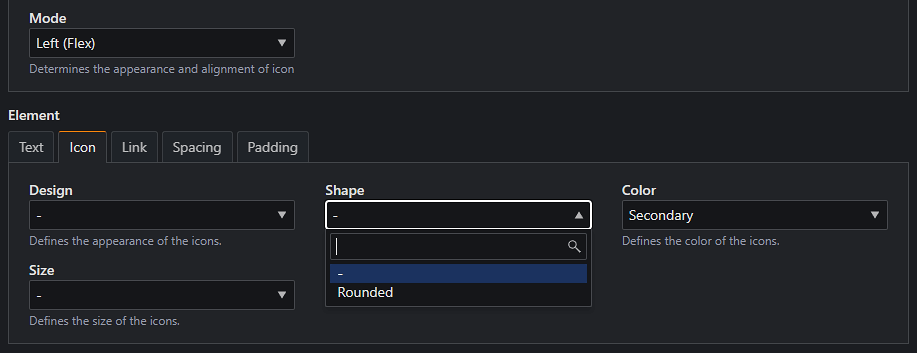
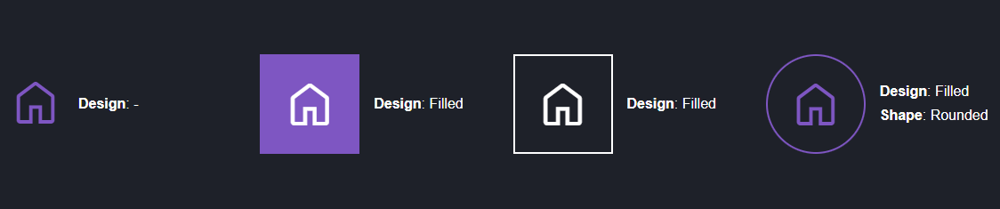

# Komponenten

Die derzeitigen Einstellungen der Komponenten im ThemeManager definieren momentan das Erscheinungsbild von
Inhaltselementen, Modulen, Tabellen und der visuellen Trennung zwischen zwei Artikeln.

---

## Box

Im eigentlichen Sinne auch als `Card` oder `Kachel` bekannt, existiert die `box` Eigenschaft für die verfügbaren Gruppen
'Components' und 'Elements' im StyleManager.

!!! info "Erklärungen zu StyleManager Gruppen"

    Mehr zu den StyleManager-Gruppen `Global`, `Components` und `Elements` kann
    [hier](../backgrounds.md#exkurs-global-component-und-element) nachgelasen werden.

Wird im StyleManager-Reiter `Layout` eine der Optionen unter `Box` aktiviert, werden der Hintergrund und der Rahmen der
Komponente bzw. der sich darin befindlichen Elemente gemäß den hier konfigurierten CSS-Einstellungen geändert.

### Exkurs: Padding von Components und Elements

Wenn die Option `box` aktiviert ist, greifen automatisch `$top-bottom-padding-small` und `$left-right-padding-small`,
die in [Abstände (Innen)](layout.md#abstände-innen) eingestellt werden können.

Innerhalb von `Components` und `Elements` kann das Padding für jeden [Breakpoint](layout.md#breakpoints) einzeln
konfiguriert werden.

Die Option `Reset` hebt den Innenabstand auf. Diese Option empfiehlt sich jedoch nur für Bilder. Bild-Text-Elemente
haben eine zusätzliche Einstellung, um das Bild an den Rahmen zu binden, sodass der Text mit dem Padding versehen wird.

!!! info

    Abweichend der Einstellungen `Top`, `Bottom`, `Left` und `Right` des
    [äußeren Abstands (Margin)](layout.md#abstände-außen), existiert für das Padding nur eine Option.

### Hintergrundfarbe

`$boxed-background-color`

Diese Einstellung beeinflusst die Hintergrundfarbe (`background-color`) der Kachel für folgende StyleManager-Gruppen:

**Components**

```css
.box > .inside
```

**Elements**

```css
.box-list .item > .inside
```

Der Standardwert ist hier die Hintergrundfarbe des `<body>` sofern nicht anders konfiguriert.

!!! tip "Weitere Hintergrundfarben in Components und Elements"

    Die hier gesetzte Hintergrundfarbe kann jederzeit durch eine Hintergrundfarbe innerhalb der `Components` und 
    `Elements`-Gruppen überschrieben werden. Details dazu können im Kapitel 
    [Hintergründe](../backgrounds.md#weitere-optionen) nachgelesen werden.

    Wenn eine dunkle Hintergrundfarbe ausgewählt wird, können die Textfarben der Listen-Items über 
    `Components > Text > Text-Color` und die der Überschrift über `Global > Headlines > Text-Color` (oder im Artikel) 
    angepasst werden.

??? example "Verfügbare (S)CSS-Variablen"

    <div class="grid" markdown>
    ```scss title="SCSS"
    $boxed-background-color
    ```
    ```css title="CSS"
    /* Components (.box) */
    var(--b-bg)

    /* Elements (.box-list) */
    var(--i-bg)
    ```
    </div>

### Rahmen

`$boxed-border-color` `$boxed-border-radius` `$boxed-border-width` `$boxed-border-style`

Bekannt als `border`, stehen uns hierbei die folgenden Einstellungen zur Verfügung, sodass der Rahmen der Kachel
beeinflusst werden kann.

<a style="display: block; background: var(--md-code-bg-color); text-align: center; margin: 1em 0; padding: 25px; border: solid 1px var(--md-primary-fg-color)" title="Rahmenfarbe" href="https://developer.mozilla.org/en-US/docs/Web/CSS/border-color">
  Rahmenfarbe</a>
<a style="display: block; background: var(--md-code-bg-color); text-align: center; margin: 1em 0; padding: 25px; border: solid 1px var(--md-primary-fg-color); border-radius: 50px" title="Rahmenradius" href="https://developer.mozilla.org/en-US/docs/Web/CSS/border-radius">
  Rahmenradius</a>
<a style="display: block; background: var(--md-code-bg-color); text-align: center; margin: 1em 0; padding: 25px; border: solid 5px var(--md-primary-fg-color)" title="Rahmenbreite" href="https://developer.mozilla.org/en-US/docs/Web/CSS/border-width">
  Rahmenbreite</a>
<a style="display: block; background: var(--md-code-bg-color); text-align: center; margin: 1em 0; padding: 25px; border: dotted 5px var(--md-primary-fg-color)" title="Rahmenstil" href="https://developer.mozilla.org/en-US/docs/Web/CSS/border-style">
  Rahmenstil</a>

??? example "Verfügbare (S)CSS-Variablen"

    <div class="grid" markdown>
    ```scss title="SCSS"
    $boxed-border-width
    $boxed-border-style
    $boxed-border-color
    $boxed-border-radius
    ```
    ```css title="CSS"
    var(--b-bdr-wdth)
    var(--b-bdr-style)
    var(--b-bdr-clr)
    var(--b-bdr-r)
    ```
    </div>

### Die Option box-shadow

Bei Einstellung der Option `box-shadow` wird ein zusätzlicher Schatten/Schlagschatten ergänzt, der in den
[sonstigen Einstellungen](miscellaneous.md#schatten--schlagschatten) konfiguriert werden kann.

Wenn für alle Box-Komponenten nur der Schlagschatten ohne Rahmen erwünscht ist, kann der `$boxed-border-width` auf `0`
gestellt werden. Soll der Rahmen bei `box` weiterhin bestehen bleiben, kann eine Option über einen eigenen
[Skin](../../guides/skin/introduction.md) individuell erweitert werden.

---

## Linien (Divider)

`$divider-size` `$divider-style` `$divider-color`

Linien sind Rahmen, die in Artikeln verwendet werden, um diese optisch vom vorherigen oder nachfolgenden Artikel zu
trennen.

In den StyleManager-Optionen von Artikeln stehen sowohl für den oberen (Top) als auch für den unteren (Bottom) Rahmen
folgende Optionen unter `Component > Divider` zur Verfügung:

| Option | Beschreibung                                                                                                                                        |
|--------|-----------------------------------------------------------------------------------------------------------------------------------------------------|
| Full   | Durch Setzen der Option `Full` wird zwischen den Artikeln eine Linie mit voller Breite gesetzt, sodass die gesamte Bildschirmbreite verwendet wird. |
| Inner  | Die Option `Inner` folgt dem inneren Abstand von Artikeln, sodass sie sich anhand der Breite der Inhaltselemente orientiert.                        |

Folgende Einstellungen können hierbei vorgenommen werden:

- `$divider-size`: Höhe der Linie
- `$divider-style`: [Stil](https://developer.mozilla.org/en-US/docs/Web/CSS/border-style) der Linie
- `$divider-color`: Farbe der Linie

??? example "Verfügbare SCSS-Variablen und Klassen"

    <div class="grid" markdown>
    ```scss title="SCSS"
    $divider-size
    $divider-style
    $divider-color
    ```
    ```css title="Klassen"
    .line-top /* Top -> Full */
    .line-btm /* Bottom -> Full */
    .line-inner-top /* Top -> Inner*/
    .line-inner-btm /* Bottom -> Inner*/
    ```
    </div>

---

## Tabelle

Über die nachfolgenden Einstellungen kann das Aussehen von Tabellen `<table>` auf der Website angepasst werden.

!!! warning

    Alle hier eingestellten Tabellenstyles beeinflussen das Element `<table>`, sodass auch jene Tabellen gestyled
    werden, welche im TinyMCE-Editor erstellt wurden.

    Es ist derzeit nicht möglich, dass Tabellenstyles über den StyleManager *aktiviert oder *deaktiviert* werden können.
    Ist dies nicht erwünscht, können Tabellen im eigenen [Skin](../../guides/skin/introduction.md) angepasst werden.

### Tabellenzelle

`$table-cell-spacing` `$table-cell-padding` `$table-cell-border-radius`

Der Abstand zwischen Zellen kann über die Variable `$table-cell-spacing` eingestellt werden, der innere Abstand
über `$table-cell-padding`.

Wird zusätzlich eine Zellen-Hintergrundfarbe gesetzt, wird der Rahmenradius (`$table-cell-border-radius`) sichtbar.

### Rahmen

**Tabelle (Außen)**

`$table-border-color` `$table-border-style` `$table-border-width`

Beeinflusst die Rahmenfarbe, den Rahmenstil sowie die Rahmenbreite einer **Tabelle** (`<table>`).

**Tabellenkopf**

`$table-head-border-color` `$table-head-border-style` `$table-head-border-width`

Beeinflusst die Rahmenfarbe, den Rahmenstil sowie die Rahmenbreite eines **Tabellenkopfs** (`<th>`).

**Tabellenzelle**

`$table-cell-border-color` `$table-cell-border-style` `$table-cell-border-width`

Beeinflusst die Rahmenfarbe, den Rahmenstil sowie die Rahmenbreite einer **Tabellenzelle** (`<td>`).

### Tabellenbeschreibung

`$table-caption-*`

Oft unter der Tabelle positioniert, kann
die [Tabellenbeschreibung](#https://developer.mozilla.org/en-US/docs/Web/HTML/Element/caption) genutzt werden, um den
Inhalt einer Tabelle zusammenzufassen. Diese kann über `$table-caption-side` unter oder über der Tabelle angezeigt
werden, über das `$table-caption-alignment` kann der Text ausgerichtet werden.

Weitere Einstellungen wie Innenabstand, Farbe, Hintergrund und Schriftgröße sind möglich.

### Textausrichtung

`$table-text-align`

Standardmäßig steht die Text-Ausrichtung einer Tabelle auf `inherit`, sodass diese durch die Einstellungen eines
Artikels oder Inhaltselements kontrolliert werden können. Über `$table-text-align` kann die Text-Ausrichtung für alle
Tabellen global kontrolliert werden.

### Schriftstärken

`$table-head-font-weight` `$table-body-font-weight` `$table-foot-font-weight`

Über diese Einstellungen kann die Schriftstärke von Tabellenkopf, normalen Zellen und dem Tabellenfuß eingestellt
werden. Mehr Informationen zu Schriftstärken kann dem Kapitel [Schriften](fonts.md#schriftstärken) entnommen werden.

### Farben

`$table-head-*` `$table-foot-*` `$table-body-*`

Über diese Variablen lassen sich die Textfarbe (`-color`), sowie die Hintergrundfarbe (`-background`) der nachfolgenden
Bestandteile einer Tabelle einstellen:

- Tabellenkopf (`$table-head-*`)
- Tabellenfuß (`$table-foot-*`)
- Gerade Zellen (`$table-body-even-*`)
- Ungerade Zellen (`$table-body-odd-*`)

---

## Icon

Bis auf die Icon-Schriftart bezieht sich die nachfolgende Konfiguration auf das Aussehen der durch den ThemeManager
bereitgestellten Inhaltselemente `Icon`, `Icon-Text` und `Icon-Text-Liste`.

{loading=lazy}

### Icon-Schriftart

`$icon-font-family`

Diese Einstellung überschreibt die Schriftart der Icons, die vom ThemeManager verwendet werden.

!!! danger "Ändern der $icon-font-family"

    Wird die Einstellung `"ctm-icon"` abgeändert, funktioniert die unter [Icons](../icon-set.md) beschriebene
    Generierung und Bereitstellung von Icons nicht mehr.

    Das Ändern der hier eingestellten Schriftart wird nur empfohlen, wenn das Feature nicht benötigt wird und die
    verwendeten Icons über einen eigenen [Skin](../../guides/skin/introduction.md) festgelegt werden.

### Größe der Icons

`$icon-size-tiny` `$icon-size-small` `$icon-size-medium` `$icon-size-large` `$icon-size-large`

Die Icon-Größe bestimmt die Schriftgröße des ausgewählten Icons und kann im StyleManager für Icon-Elemente eingestellt
werden. Unter der Einstellung Size finden sich die Optionen `tiny`, `small`, `medium` und `large`. Der Standard-Wert
bei keiner Einstellung ist `medium`.

### Innerer Abstand

`$icon-shape-spacing`

Die Gestaltung des Inneren eines Icons wird durch `$icon-shape-spacing` innerhalb der Icon-Einstellungen beeinflusst.
Sowohl bei `Filled` als auch bei `Outline` wird ein innerer Abstand gesetzt, der durch `$icon-shape-spacing` definiert
wird.

### Icon Designs

`$icon-outlined-width`

Über die Optionen `Design` sowie `Shape` kann das Aussehen von Icons modifiziert werden.
{loading=lazy}
Die Auswahl des Designs `Outline` in den zuvor beschriebenen Einstellungen bewirkt das Hinzufügen eines Rahmens um das
Icon. Die Breite des Rahmens kann über `$icon-outlined-width` eingestellt werden.

### Exkurs: Layout Mode für Icon- und Bild-Text

Sowohl in `Icon-` als auch `Bild-Text`-fähigen Elementen und Modulen kann unter `Components > Layout` der `Mode`
eingestellt werden, durch welches sich das Layout ändert.

**Icon-Text**

| Mode          | Beschreibung                                                                                                                                                          |
|---------------|-----------------------------------------------------------------------------------------------------------------------------------------------------------------------|
| -             | Das Icon wird über dem Text angezeigt.                                                                                                                                |
| Top           | Das Icon wird über dem Text angezeigt und bekommt einen Abstand.                                                                                                      |
| Left (Flex)   | Das Icon wird über `CSS-Flexbox` links vom Text angezeigt.                                                                                                            |
| Right (Flex)  | Das Icon wird über `CSS-Flexbox` rechts vom Text angezeigt.                                                                                                           |
| Left (Float)  | Das Icon [floatet](https://developer.mozilla.org/en-US/docs/Web/CSS/float) links vom Text. Ist der Text länger als die Größe des Bildes, umschließt dieser das Icon.  |
| Right (Float) | Das Icon [floatet](https://developer.mozilla.org/en-US/docs/Web/CSS/float) rechts vom Text. Ist der Text länger als die Größe des Bildes, umschließt dieser das Icon. |

!!! tip

    Ist ein Modus eingestellt, kann das `Element -> Spacing` genutzt werden, um den Abstand von Icon zu Text einzustellen.

**Bild-Text**

| Mode                | Beschreibung                                                                                                                                                         |
|---------------------|----------------------------------------------------------------------------------------------------------------------------------------------------------------------|
| -                   | Das Bild wird über dem Text angezeigt.                                                                                                                               |
| Flex                | Aktiviert `CSS-Flexbox` und ermöglicht die Positionierung des Bildes auf vertikaler (`Vertical Alignment`) und horizontaler Achse (`Horizontal Alignment`).          |
| Float               | [Floatet](https://developer.mozilla.org/en-US/docs/Web/CSS/float) das Bild und ermöglicht die Positionierung des Bildes auf vertikaler (`Vertical Alignment`) Achse. |
| Text-within         | Positioniert den Text absolut **über** dem Bild und sollte nur mit passenden Bildgrößen und wenig Text verwendet werden.                                             |
| Text-within (Hover) | Hat den selben Effekt wie `Text-within`, der Text wird jedoch ausgeblendet und ist nur bei Hover oder Klick sichtbar.                                                |

Für Bild-Text werden weitere Einstellungen bereitgestellt, sodass `Cards` konfiguriert werden können:

**Horizontal Alignment**

Positioniert das Bild `Links` oder `Rechts` und kann je nach Modus mit `Vertical Alignment` verwendet werden.

**Vertical Alignment**

Positioniert das Bild `Oben` oder `Unten` und **funktioniert nicht** im `Float`-Modus.

**Width**

Über diese Option kann die Breite des Bildes eingestellt werden. Weitere Optionen können über die
[$image-text-ratio-options](layout.md#bild-text) ergänzt werden.

!!! abstract "Dynamische Variable"

    Hierbei handelt es sich um eine dynamische Variable, welche weitere Optionen ergänzen kann.

    Dynamische Einstellungen stehen erst nach `Speichern & Kompilieren` zur Verfügung, da die neuen Optionen sowohl in
    den Style-Sheet-Dateien als auch in den dynamischen Style-Manager-Optionen (templates/style-manager-tm.xml)
    hinterlegt werden.

**Image outset**

Wenn `Box`, der `Flex`-Modus und `Vertical Alignment` konfiguriert sind, kann das Bild durch Aktivieren dieser Option
auf die gesamte Breite der Kachel gestreckt werden.

**Image stretch**

Wenn `Box`, der `Flex`-Modus und `Horizontal Alignment` konfiguriert sind, kann das Bild durch Aktivieren dieser Option
auf die gesamte Höhe der Kachel gestreckt werden.

---

Mehr Informationen zum Verhalten von Bild und Text im `Box`-Modus können im
[`Exkurs: Padding von Components und Elements`](#exkurs-padding-von-components-und-elements) nachgelesen werden.

!!! info "Text-Modus und Mobile Ansicht von Bild-Text"

    **Text-Modus**

    Wird einer der `Text-within`-Modi eingestellt, beeinflussen die Optionen `Vertical Alignment`,
    `Horizontal Alignment`, `Width` und `Element -> Spacing` das Verhalten des Textes.

    ---    

    **Layout-Aktivierung ab bestimmter Bildschirmbreite**

    Wird ein Bild links oder rechts vom Text positioniert, greift diese Einstellung erst ab der eingestellten
    Bildschirmbreite unter [$image-text-behaviour-min-width](layout.md#bild-text).

---

## Medien

### Video

`$video-bg`

Dient der Einstellung der Hintergrundfarbe von selbst gehosteten Videos, welche über das Element Video eingebunden
werden. Für Videos können nicht nur Höhe und Breite eingegeben werden, es kann auch ein Video-Poster (Vorschaubild)
ausgewählt werden, welches jedoch keine Bildgröße erhält.

Es wird empfohlen, dass das genutzte Vorschaubild dasselbe Seitenverhältnis wie das des Videos hat. Sollte dies nicht
ausreichen, kann im StyleManager unter `Element > Image` das
[Seitenverhältnis](miscellaneous.md#seitenverhältnisse-für-bilder) angepasst werden. Dieses beeinflusst den Container
des Videos, sodass das Video seine Originalgröße behält.
