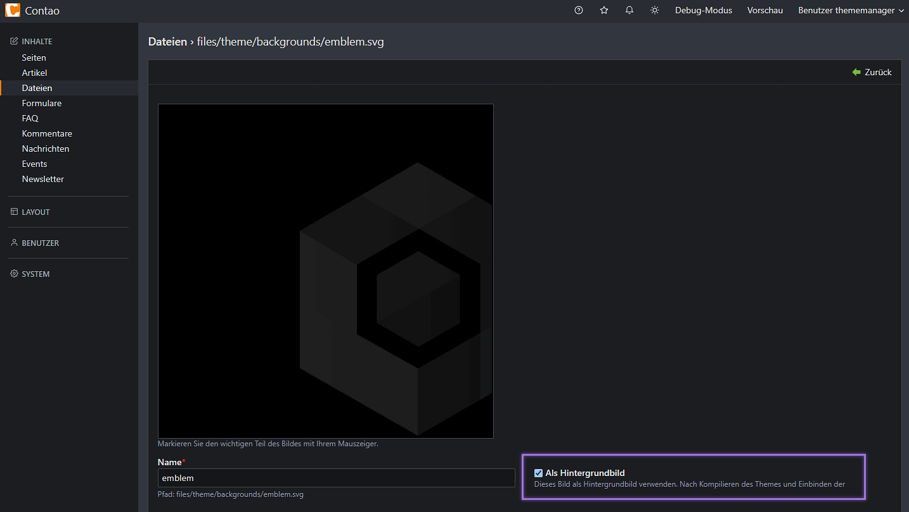
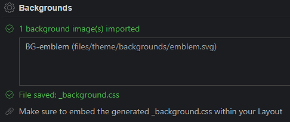
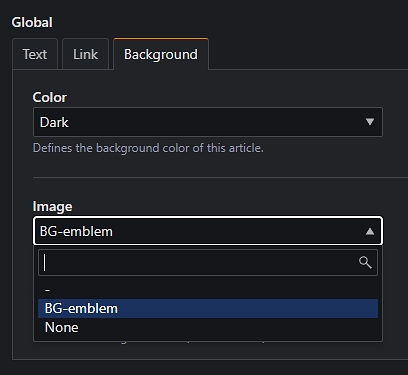
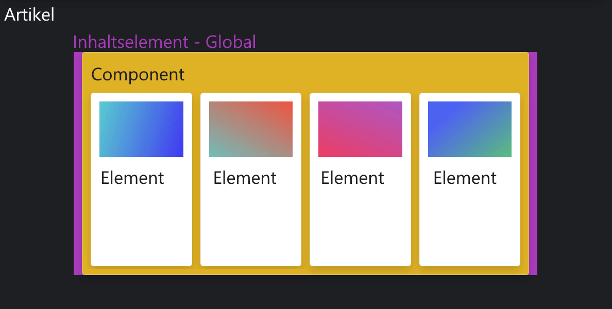
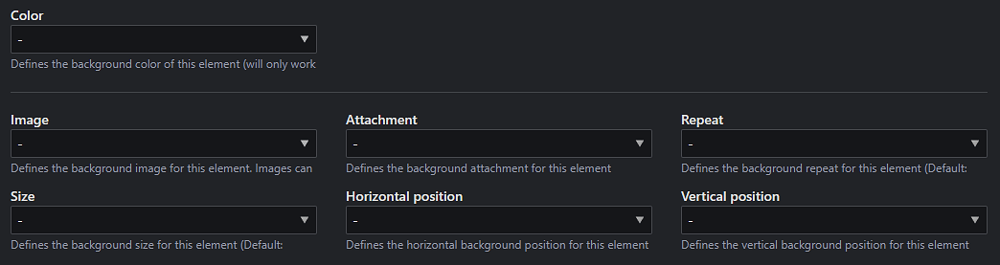
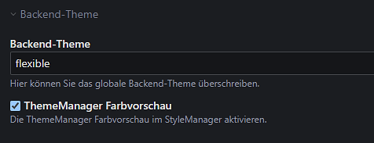
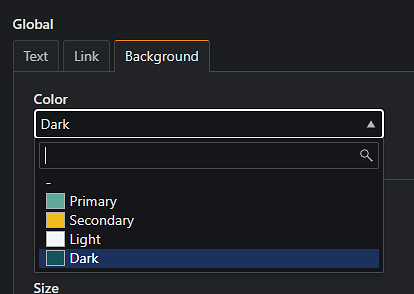

# Hintergrundbilder

In zahlreichen Situationen besteht der Wunsch der Anwender, Hintergrundbilder zu integrieren. Oftmals erweist sich dies
für sie als nicht eigenständig umsetzbar, wodurch professionelle Unterstützung erforderlich wird.

Der Prozess gestaltet sich wie folgt:

- (Hochladen des Bildes)
- Hinterlegung des Bildpfads in einer CSS-Datei
- Lokale Kompilierung der CSS-Datei
- Hochladen der CSS-Datei
- Setzen der CSS-Klasse

Ein weiteres Problem entsteht, wenn der Anwender dasselbe Hintergrundbild in einem anderen Artikel verwenden möchte. In
solchen Fällen ist es notwendig, dass er die zugehörige CSS-Klasse kennt und manuell setzt. Bei einer Vielzahl von
Hintergrundbildern bedeutet dies, dass jede einzelne CSS-Klasse dem Anwender bekannt sein muss.

## Hinzufügen und entfernen

Der ThemeManager erweitert eine Option im Dateisystem, sodass Bilder als Hintergrundbild definiert werden können.

<figure markdown>
  {loading=lazy}
  <figcaption>Über die Option kann ein Hintergrundbild festgelegt werden</figcaption>
</figure>

Da das `CSS` für Hintergrundbilder erst generiert werden muss, stehen diese erst nach Kompilieren des Themes zur
Verfügung.

<figure markdown>
  {loading=lazy}
  <figcaption>Der Asset-Compiler listet alle verfügbaren Hintergründe auf</figcaption>
</figure>

!!! warning "Entfernen von Hintergrundbildern"

    Wird die entfernte Datei bereits als Hintergrundbild eingebunden, bleibt diese Option im Element als 
    "unbekannte Option" bestehen. Die CSS-Klasse existiert weiterhin bis die Auswahl im Inhaltselemt/Artikel etc.
    entfernt wird.

Die Generierung von Hintergrund-Bildern** findet global statt, sodass Backgrounds Theme-übergreifend zur Verfügung
stehen.

## Auswählen und einstellen

Anwender können die Hintergrundbilder unter dem Reiter Background auswählen. Die Beschriftung der Hintergrundbilder
im Backend folgt hierbei dem Schema `BG-[Dateiname]`.

{loading=lazy}

### Wo kann ich Hintergrundbilder einstellen?

Die nachfolgende Tabelle zeigt auf, wo Hintergrundbilder eingestellt werden können und wie sie sich auswirken.

| Ort                           | Beschreibung                                                                                                                                                                                                                                                                                                |
|-------------------------------|-------------------------------------------------------------------------------------------------------------------------------------------------------------------------------------------------------------------------------------------------------------------------------------------------------------|
| Layout<br>(Global)            | Ist ein Hintergrundbild im Layout eines Themes eingestellt, wird es auf jeder Seite angezeigt, in welchem das Layout zum Einsatz kommt. Die CSS-Klasse wird in den `<body>` geschrieben.                                                                                                                    |
| Seiten<br>(Global)            | Ist ein Hintergrundbild in einer Seite eingestellt, wird es auf der Seite angezeigt.<br>Auch hier wird die Klasse in den `<body>` geschrieben. Das hier eingestellte Bild überschreibt nicht die im Layout eingestellte Option.                                                                             |
| Artikel<br>(Global)           | Sofern ein Hintergrundbild in einer Seite mit dem [Layout für volle Breite](../installation/setup.md#layout-für-volle-breite) ausgewählt wird, erstreckt sich das Hintergrundbild auf die komplette Bildschirm-Breite. Es wird nicht empfohlen, Hintergründe in Artikeln  einzustellen.                     |
| Inhaltselement<br>(Component) | Bei Auswahl eines Background unter Component, wird das Hintergrundbild in einem Inhaltselement hinterlegt.                                                                                                                                                                                                  |
| Inhaltselement<br>(Element)   | Hintergründe für Elemente werden nur in Listen angezeigt. Hierbei wird das Bild in jedes Listen-Item gesetzt.                                                                                                                                                                                               | | |

Die Einstellungen für *Component* und *Element* verhalten sich in Modulen gleich.

!!! tip "Bilder und Farben"

    Hintergrundbilder können mit der Hintergrundfarbe kombiniert werden, wenn sie transparent sind oder in der Größe
    eingeschränkt werden (standardmäßig werden Hintergrundbilder immer auf die verfügbare Breite gestreckt). Dadurch ist
    eine Kombination aus Hintergrundfarbe und Hintergrundbild möglich.

#### Exkurs: Global, Component und Element

Während in Version 1 des ThemeManagers noch alle Einstellungen den Gruppen `Design` und `Layout` zugeordnet wurden, gibt
es seit Version 2 eine neue Zuordnung, welche sich näher am HTML orientieren.

Nicht alle der CSS-Klassen, welche über den StyleManager eingestellt werden, werden im CSS-Feld von Contao gespeichert.
Der StyleManager ermöglicht es, dass CSS-Klassen an ausgewählten Stellen in einem Template ausgegeben werden können
(Template-Variablen).

<figure markdown>
  {loading=lazy}
  <figcaption>Hervorhebung der Gruppen anhand einer Bild-Text-Liste. Lila hebt lediglich das gesamte Element (Global) hervor</figcaption>
</figure>

!!! info "Template-Struktur der Gruppen"

    **Global**

    Grundsätzlich werden die meisten Einstellungen dieser Gruppe direkt in die `CSS-Klasse ($this->class)` geschrieben.
    Lediglich `Headline` und `Pagination` werden im Core als Template-Variable ausgegeben.

    ---

    **Component**

    Die Komponenten-Einstellungen beziehen sich grundsätzlich auf den optischen Inhalt eines Inhalts-Elements bzw.
    Moduls. Fast alle CSS-Klassen werden als `Template-Variable` übergeben und werden meist in `.class > .inside`
    geschrieben.

    ---

    **Element**

    In der Gruppe Elemente befinden sich Einstellungen, welche sich auf die HTML-Elemente innerhalb beziehen. Hierzu
    gehören Listen-Items, Icons, Links, Bilder, Text etc.

### Weitere Optionen

Die im StyleManager verfügbaren Hintergrund-Einstellungen können genutzt werden, um das Verhalten des festgelegten
Hintergrunds zu beeinflussen.

{loading=lazy}

Die nachfolgende Tabelle erklärt alle weiteren Optionen, wobei der Standardwert bereits der `Best-Practice` folgt.

| Einstellung         | Standardwert                                                                     | Beschreibung                                                                                                                                                                                                                                                                                                                                                                                                                                                         |
|---------------------|----------------------------------------------------------------------------------|----------------------------------------------------------------------------------------------------------------------------------------------------------------------------------------------------------------------------------------------------------------------------------------------------------------------------------------------------------------------------------------------------------------------------------------------------------------------|
| Color               | -                                                                                | Hiermit kann eine Hintergrundfarbe ausgewählt werden. Eine Kombination mit transparenten Hintergrundbildern ist möglich.                                                                                                                                                                                                                                                                                                                                             |
| Image               | [none](https://developer.mozilla.org/en-US/docs/Web/CSS/background-image)        | Dient der Auswahl des Hintergrundbildes. Über die Option `none` kann ein über den [Skin](skin.md) gesetztes Hintergrundbild entfernt werden.                                                                                                                                                                                                                                                                                                                         |
| Attachment          | [scroll](https://developer.mozilla.org/en-US/docs/Web/CSS/background-attachment) | Über diese Einstellung wird das Hintergrundbild in der Position im Browserfenster fixiert, sodass dieses beim Scrollen an der selben Stelle bleibt.                                                                                                                                                                                                                                                                                                                  |
| Repeat              | [no-repeat](https://developer.mozilla.org/en-US/docs/Web/CSS/background-repeat)  | Background-Repeat kann genutzt werden, damit kleine Bilder auf einer großen Fläche wiederholt werden. Wirkt nicht, wenn etwas in `Size` eingestellt wurde.                                                                                                                                                                                                                                                                                                           |
| Size                | [cover](https://developer.mozilla.org/en-US/docs/Web/CSS/background-size)        | Diese Einstellung bestimmt die Größe des eingesetzten Hintergrundbildes.<br><br>Über `contain` wird das Bild so groß wie möglich innerhalb des Containers skaliert, ohne das Bild zu beschneiden oder zu dehnen. Wenn das Bild zu klein für den Container ist, wird das Bild gekachelt, wenn eine Einstellung in `Size` vorgenommen wurde.<br><br>Die Einstellung `auto` skaliert das Bild in der entsprechenden Richtung, sodass die Proportionen erhalten bleiben. |
| Horizontal Position | [50%](https://developer.mozilla.org/en-US/docs/Web/CSS/background-position)      | Bestimmt die *horizontale* Position des Hintergrundbildes. Wirkt nicht, wenn etwas in `Size` eingestellt wurde.                                                                                                                                                                                                                                                                                                                                                      |
| Vertical Position   | [50%](https://developer.mozilla.org/en-US/docs/Web/CSS/background-position)      | Bestimmt die *vertikale* Position des Hintergrundbildes. Wirkt nicht, wenn etwas in `Size` eingestellt wurde.                                                                                                                                                                                                                                                                                                                                                        |

!!! example "Hintergrund-Eigenschaften"

    Die in der Tabelle aufgeführten Einstellungen sind die verfügbaren CSS-Eigenschaften für Hintergrundbilder.

    Im Standard werden folgende Optionen nach der Best Practice gesetzt, sodass keine Einstellungen vorgenommen werden
    müssen:

    ```css
        background-image: ...;
        background-attachment: scroll;
        background-position: 50% 50%;
        background-repeat: no-repeat;
        background-size: cover;
    ```

## Cascading Style Sheet

Für jede als Hintergrund ausgewählte Datei werden zwei CSS-Klassen erstellt. Das CSS einer Datei mit dem Namen
`emblem.svg` sieht wie folgt aus:

```css
.bgi-emblem {
    --bgi: url(/files/theme/backgrounds/emblem.svg);
}

.i-bgi-emblem {
    --i-bgi: url(/files/theme/backgrounds/emblem.svg);
}
```

!!! question "Was bedeutet `.bgi` und `.i-bgi`?"

    Der erste Präfix steht für `background-image` und setzt Hintergrundbilder im selben Container,
    der zweite steht für `item-background-image` und vererbt Hintergrundbilder in Kinds-Elemente innerhalb von 
    Listen, sodass Hintergründe auch für diese erstellt werden können.

## Farben-Vorschau für Backend-Nutzer

Innerhalb der [Benutzer-Einstellungen](https://docs.contao.org/manual/de/benutzerverwaltung/benutzer/#backend-theme)
wurde eine neue Funktion hinzugefügt, welche in diversen Einstellungen von Hintergrund- und Textfarben die derzeit
*kompilierte* Farbe anzeigen. 

Werden eigene Hintergrundfarben im StyleManager ergänzt, wird ein Platzhalter angezeigt.

<figure markdown>
  {loading=lazy}
  <figcaption>Aktivieren der Farbvorschau in den Benutzer-Einstellungen</figcaption>
</figure>

<figure markdown>
  {loading=lazy}
  <figcaption>Farbvorschau innerhalb der Hintergrundfarben</figcaption>
</figure>

!!! warning "Farbvorschau ist nicht Theme-übergreifend"

    Diese Option wird global gesetzt, sodass die Farben nicht über mehrere erstellte Themes angezeigt werden können.
    Es wird immer das letzte kompilierte Theme in Betracht gezogen.
