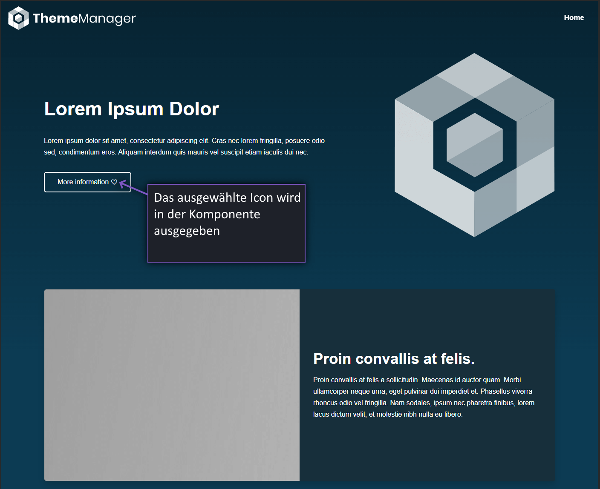
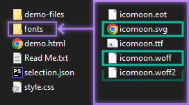
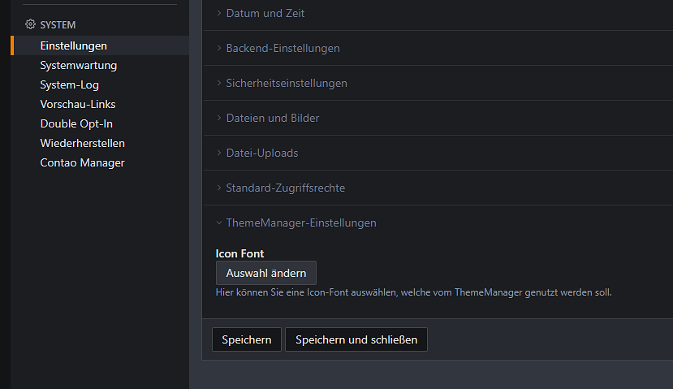
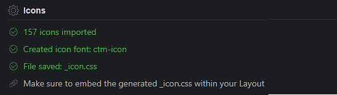
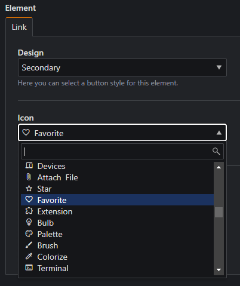
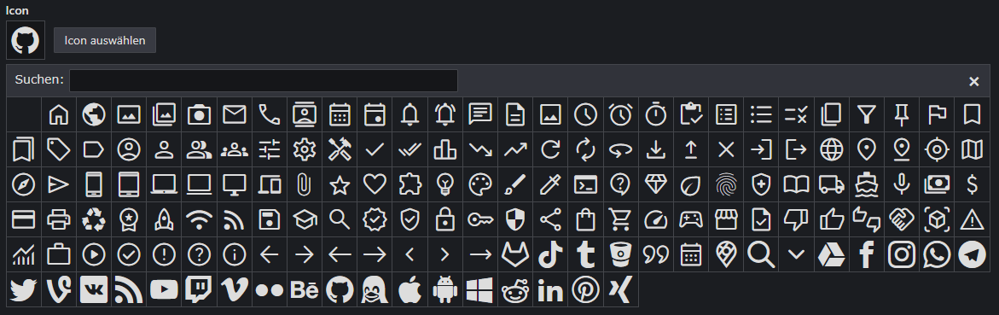
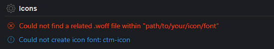
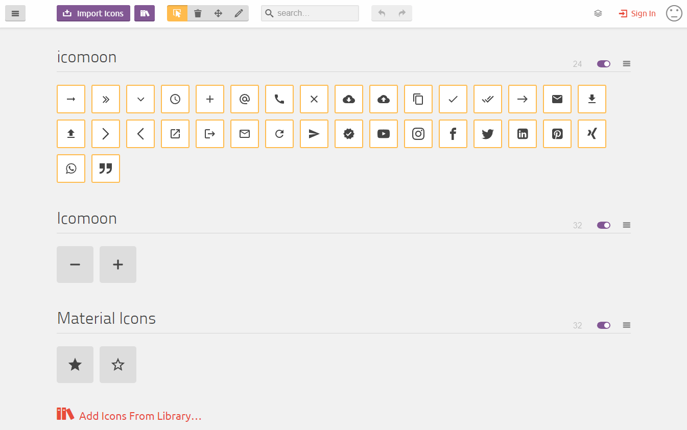

# Integration von Icon-Fonts mit dem ThemeManager

Bei der Verwendung von Icon-Fonts, die über Dienste wie IcoMoon oder Fontello erstellt und heruntergeladen wurden,
stellt sich oft die Herausforderung, die zugehörigen CSS-Dateien einzubinden und die entsprechenden Klassen in Templates
oder CSS-Anpassungen für Komponenten zu integrieren.

{loading=lazy}

Der Contao ThemeManager ermöglicht es Anwendern, ihr Icon-Set direkt in den Systemeinstellungen auszuwählen. Automatisch
generiert der ThemeManager das benötigte CSS, und die festgelegten Optionen stehen systemweit im StyleManager zur
Verfügung. Hiermit wird eine unkomplizierte Verwendung von Icons in Listen, Downloads, Links, Buttons, Formularfeldern
uvm. auf der Website ermöglicht.

!!! tip "RockSolid Custom Elements"

    Über die Erweiterungen [RockSolid Custom Elements](https://github.com/madeyourday/contao-rocksolid-custom-elements)
    und [Rocksolid Icon Picker](https://github.com/madeyourday/contao-rocksolid-icon-picker) werden zusätzliche 
    Inhaltselemente bereitgestellt, in welchen Icons ausgewählt werden können.

## Icon-Set im System einstellen

Eine Icon-Schriftart kann über Dienste wie [IcoMoon](https://icomoon.io/) oder [Fontello](https://fontello.com/)
erstellt und anschließend heruntergeladen werden. Wenn es sich um eine `.zip`-Datei handelt, muss diese zunächst
entpackt werden.

Im Download einer IcoMoon-Schriftart befinden sich die benötigten Dateien im Ordner `fonts`:

{loading=lazy}

Folgende Dateien müssen in *einen Ordner* abgelegt werden:

- `*.svg`
- `*.woff` oder `*.woff2`

Um die Icon-Schriftart einzubinden, muss die `*.svg` unter `System` -> `Einstellungen` in den ThemeManager-Einstellungen
eingebunden werden.

{loading=lazy}

!!! tip

    Während der *Kompilierung* des Themes werden die Icons generiert, sodass diese in den Icon-Komponenten und den
    Style-Manager Einstellungen ergänzt werden.

Nach Kompilieren des Themes stehen die neuen Icons in den Komponenten bereit.

<figure markdown>
  {loading=lazy}
  <figcaption>Asset-Compiler Report</figcaption>
</figure>

<figure markdown>
  {loading=lazy}
  <figcaption>Icons innerhalb der Link-Einstellungen</figcaption>
</figure>

<figure markdown>
  {loading=lazy}
  <figcaption>Icon-Auswahl im RockSolid Icon-Picker</figcaption>
</figure>

!!! danger "Ändern der Icon-Schriftart in der Theme-Konfiguration"

    Sofern die Icon-Font-Family in den [Icon-Einstellungen](theme/components.md#icon) verändert wurde
    `(Default: 'ctm-icon')`, können die durch den ThemeManager generierten Icons nicht korrekt angezeigt werden.

### Hinweise und Fehlermeldungen

{loading=lazy}

Folgende Hinweise und Fehlermeldungen können vom Asset-Compiler zurückgegeben werden:

| Fehlermeldung                                                                 | Information / Behebung des Fehlers                                                                                                                                                                                            |
|-------------------------------------------------------------------------------|-------------------------------------------------------------------------------------------------------------------------------------------------------------------------------------------------------------------------------|
| :information_source: No ThemeManager icon font specified within your settings | Es wurde keine Icon-Font im System eingestellt                                                                                                                                                                                |
| :red_circle: The path: `...` does not exist                                   | Der Dateipfad der eingestellten Icon-Schriftart existiert nicht mehr. Kontrolliere in den Einstellungen ob der Ordner existiert und stelle sie erneut ein.                                                                 |
| :red_circle: Could not find a .svg file within `...`                          | Die `.svg` der Icon-Schriftart konnte nicht gefunden werden. Kontrolliere in den Einstellungen ob die .svg existiert und stelle sie erneut ein.                                                                            |
| :red_circle: Could not find a related .woff file within `...`                 | Es wurde eine `.svg` eingestellt, im selben Ordner befindet sich jedoch keine `*.woff`/`*.woff2`-Datei. Kontrolliere die eingestellte Icon-Schriftart und füge im selben Ordner die fehlende `*.woff`/`*.woff2`-Datei ein. |
| :red_circle: Could not find a related .woff file within `...`                 | Es wurde eine `.svg` eingestellt, im selben Ordner befindet sich jedoch keine `*.woff`/`*.woff2`-Datei. Kontrolliere die eingestellte Icon-Schriftart und füge im selben Ordner die fehlende `*.woff`/`*.woff2`-Datei ein. |
| :red_circle: File: `...` does not exist                                       | Der Dateipfad der eingestellten Icon-Schriftart existiert nicht mehr. Kontrolliere in den Einstellungen ob der Ordner existiert und stelle sie erneut ein.                                                                 |
| :red_circle: Could not find icons in \*.svg                                   | Die eingebundene `.svg`-Datei ist nicht valide. Generiere die Icon-Schriftart über IcoMoon oder Fontello neu.                                                                                                              |
| :warning: Skipped icon with unicode: `xxxx`. No glyph-name given.             | Ein Icon im enthaltenden Icon-Set wurde übersprungen. Überprüfe die `.svg`-Datei mit einem Texteditor oder einer Icon-App.                                                                                                 |

## Bestehendes Set erweitern

Um ein bestehendes Icon-Set in Zukunft zu erweitern, empfiehlt es sich die durch den Icon-Service erstellte Datei
`selection.json` im Datei-System hochzuladen.

!!! warning "*.json Dateien in der Dateiverwaltung hochladen"

    Um Dateien vom Typ `*.json` in der Dateiverwaltung hochladen zu können, muss dieser Dateityp unter
    [Erlaubte Upload-Dateitypen](https://docs.contao.org/manual/de/system/einstellungen/#datei-uploads) hinzugefügt 
    werden.

Die `selection.json` der Schriftart kann grundsätzlich über *Drag-and-Drop* in die Icon-Apps (IcoMoon / Fontello)
gezogen werden, um die Icons zu laden.

!!! tip

    Wie IcoMoon genutzt wird, kann [hier](https://icomoon.io/docs.html) nachgelesen werden. Für Fontello findet sich
    eine Dokumentation auf [GitHub](https://github.com/fontello/fontello/wiki/Help).

<figure markdown>
  {loading=lazy}
  <figcaption>Übersicht der IcoMoon-App</figcaption>
</figure>

Nach Hinzufügen von neuen Icons kann die bereits eingebundene und existierende Datei über das Dateisystem überschrieben
werden.

Es empfiehlt sich die *neue* `selection.json` wieder im Dateisystem abzulegen, damit die neu hinzugefügten Icons
bei einer erneuten Bearbeitung nicht verloren gehen.

!!! hint "Existierende Icons überschreiben"

    Wenn Name und *Glyph-code* mit der alten Version eines Icons übereinstimmen, werden die in der Website eingestellten
    Icons ausgetauscht.

!!! danger "Existierende Icons löschen"

    Werden bereits eingestellte Icons aus einem Icon-Set entfernt, werden diese nicht mehr korrekt angezeigt. Diese
    müssen in den verfügbaren Komponenten entfernt oder umgestellt werden.
    
