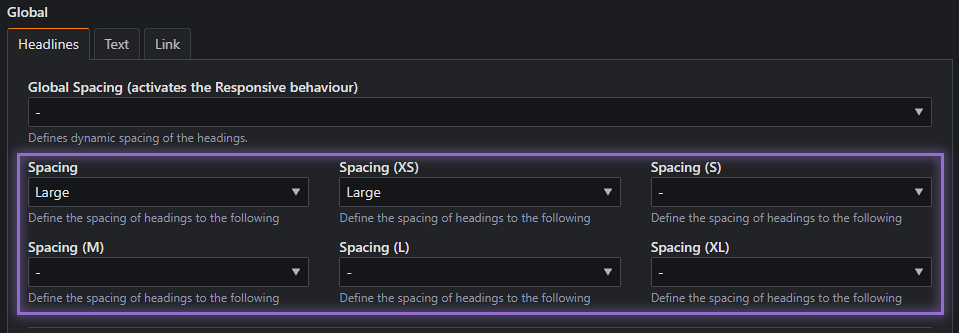
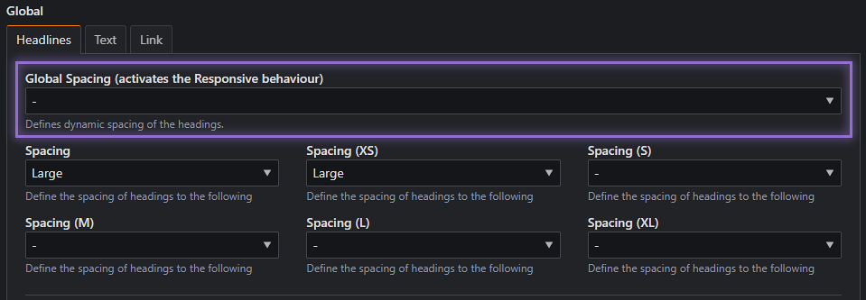

# Überschriften

!!! info

    Der ThemeManager erweitert die in Contao einstellbaren Überschriften (`<h1>` - `<h6>`) durch weitere Elemente
    (`p`, `span` & `div`) und ergänzt diese um eine Klasse, sodass sich diese Einstellungen auf die Überschrift bzw.die 
    im Element/Modul eingestellte *Überschrift*-Klasse auswirken.

## Typografie der Überschriften

Über die nachfolgenden Reiter lässt sich das Aussehen von Headlines `<h1>` - `<h6>` und CSS-Klassen `.h1` - `.h6`
verändern, wobei die folgenden Einstellungen möglich sind:

- Zeilenhöhe (*line-height*)
- Schriftgröße über verschiedene Breakpoints (*font-size*)
- Reguläre und invertierte Farbe (*color*)
- Schriftstärke (*font-weight*)
- Zeichenabstand (*letter-spacing*)
- Textdarstellung (*text-transform*)

!!! info "Einstellungen für den Inhaltsbereich?"

    Hiermit werden alle Artikel zusammengefasst, welche sich im 
    [Layout-Bereich](../../installation/setup.md#inhaltslayout) *Hauptspalte* befinden.

    Da sich die Einstellungen der Überschriften des `Volle Breite` und `Inhaltsbereich` Layout gleichen, werden diese 
    zusammen aufgefasst.

### Zeilenhöhe

`$line-height-headline` `$h[1-6]-line-height` `$h[1-6]-content-line-height`

Dient der Einstellung der vertikalen Zeilenhöhe der Überschrift und kann individuell für jede Größe eingestellt werden.

Die Variable `$line-height-headline` dient lediglich als globale Einstellung der nachfolgenden Zeilenhöhen, sodass diese
im Standard für alle Überschriften gilt.

### Schriftgrößen

`$h[1-6] - [ |content] - font-size - [ |small|medium]`

Für jede Überschrift(/-Klasse) lässt sich die Schriftgröße für die folgenden [Breakpoints](layout.md#breakpoints)
einstellen:

| Breakpoints           |       Fensterbreite | Größe / Genutzte Variable |
|-----------------------|--------------------:|--------------------------:|
| kleiner **`xs`**      |           ` <600px` |   **`*-font-size-small`** |
| **`xs`** bis  **`m`** | `600px - 1023.98px` |  **`*-font-size-medium`** |
| ab **`m`**            |           `≥1024px` |         **`*-font-size`** |

???+ example "Verfügbare (S)CSS-Variablen"

    Da sich die Schriftgrößen abhängig des Breakpoints verhalten, gibt es nur eine CSS-Custom-Property für jeden 
    Headline-Typen. 

    Die Typen (h1 - h6) beziehen sich sowohl auf den normalen als auch auf den Inhaltsbereich und müssen
    beim Kopieren der nachfolgenden CSS mit der gewünschten **Zahl** (1-6) ausgetauscht werden.

    <div class="grid" markdown>
    ```scss title="SCSS"
    $h1-font-size-small
    $h1-font-size-medium
    $h1-font-size
    ```
    ```css title="CSS"
    var(--h1-fs)
    ```
    ```scss title="SCSS"
    $h1-content-font-size-small
    $h1-content-font-size-medium
    $h1-content-font-size
    ```
    ```css title="CSS"
    var(--h1-c-fs)
    ```
    </div>

### Überschriften-Farben

`$h[1-6] - [ |content] - color [ |invert]`

Sowohl für die reguläre, als auch für die invertierte Text-Farbe können die Schriftfarben jedes Überschrift-Typen für
die zwei Layout-Bereiche eingestellt werden.

??? example "Verfügbare (S)CSS-Variablen"

    Durch die Verwendung von Custom-Properties mithilfe der Klassen `.color-text-base` und `.color-text-inv`, können
    die Farben von Überschriften überschrieben werden.

    <div class="grid" markdown>
    ```scss title="SCSS"
    /** Reguläre Farben */
    $h1-color
    $h2-color
    $h3-color
    $h4-color
    $h5-color
    $h6-color
    $h1-content-color
    $h2-content-color
    $h3-content-color
    $h4-content-color
    $h5-content-color
    $h6-content-color
    ```
    ```css title="CSS"
    /** Reguläre Farben über color-text-base */
    var(--h1-clr)
    var(--h2-clr)
    var(--h3-clr)
    var(--h4-clr)
    var(--h5-clr)
    var(--h6-clr)
    var(--h1-c-clr)
    var(--h2-c-clr)
    var(--h3-c-clr)
    var(--h4-c-clr)
    var(--h5-c-clr)
    var(--h6-c-clr)
    ```

    ```scss title="SCSS"
    /** Invertierte Farben */
    $h1-color-invert
    $h2-color-invert
    $h3-color-invert
    $h4-color-invert
    $h5-color-invert
    $h6-color-invert
    $h1-content-color-invert
    $h2-content-color-invert
    $h3-content-color-invert
    $h4-content-color-invert
    $h5-content-color-invert
    $h6-content-color-invert
    ```
    ```css title="CSS"
    /** Invertierte Farben über .color-text-inv */
    var(--h1-clr)
    var(--h2-clr)
    var(--h3-clr)
    var(--h4-clr)
    var(--h5-clr)
    var(--h6-clr)
    var(--h1-c-clr)
    var(--h2-c-clr)
    var(--h3-c-clr)
    var(--h4-c-clr)
    var(--h5-c-clr)
    var(--h6-c-clr)
    ```
    </div>

### Schriftstärke

`$h[1-6] - [ |content] - font-weight`

Dient der Einstellung der Schriftstärke pro Überschrift, welche Layout-übergreifen (Normal und Inhalt) wirken. Folgende
Schriftstärken stehen hierbei zur Verfügung, wobei diese bei einer individuell eingebundenen Schriftart im Layout
eingestellt werden müssen, damit der Effekt sichtbar ist (Im Beispiel werden nur 300, 400 und 600 geladen).

- <span style="font-weight:100">100</span>
- <span style="font-weight:200">200</span>
- <span style="font-weight:300">300</span>
- <span style="font-weight:400">400</span>
- <span style="font-weight:500">500</span>
- <span style="font-weight:600">600</span>
- <span style="font-weight:700">700</span>
- <span style="font-weight:800">800</span>
- <span style="font-weight:900">900</span>

??? example "Verfügbare SCSS-Variablen"

    <div markdown>
    ```scss title="SCSS"
    $h1-font-weight
    $h2-font-weight
    $h3-font-weight
    $h4-font-weight
    $h5-font-weight
    $h6-font-weight
    $h1-content-font-weight
    $h2-content-font-weight
    $h3-content-font-weight
    $h4-content-font-weight
    $h5-content-font-weight
    $h6-content-font-weight
    ```

### Zeichenabstand

`$h[1-6] - [ |content] - letter-spacing`

Auch bekannt als Buchstabenabstand, kann der
[Zeichenabstand](https://developer.mozilla.org/en-US/docs/Web/CSS/letter-spacing) eines Wortes für jede Überschrift
angepasst werden:

- <span style="letter-spacing: 0.02em">Ein Zeichenabstand von 0.02em</span>
- <span style="letter-spacing: 0.5px">Ein Zeichenabstand von 0.5px</span>
- <span style="letter-spacing: 2px">Mehr Zeichenabstand mit 2px</span>
- <span style="letter-spacing: 5px">Sehr viel Zeichenabstand mit 5px</span>

### Textdarstellung

`$h[1-6] - [ |content] - transform`

Die [Textdarstellung](https://developer.mozilla.org/en-US/docs/Web/CSS/text-transform) dient der Hervorhebung von Text,
wobei folgende Einstellungen möglich sind:

| Option       | Ergebnis                                                                                             | Beschreibung                                         |
|--------------|------------------------------------------------------------------------------------------------------|------------------------------------------------------|
| `uppercase`  | <span style="text-transform: uppercase">Die Textdarstellung dient der Hervorhebung von Text.</span>  | Jeder Buchstabe wird in Kleinbuchstaben umgewandelt. |
| `lowercase`  | <span style="text-transform: lowercase">Die Textdarstellung dient der Hervorhebung von Text.</span>  | Jeder Buchstabe wird in Großbuchstaben umgewandelt.  |
| `capitalize` | <span style="text-transform: capitalize">Die Textdarstellung dient der Hervorhebung von Text.</span> | Jedes Wort beginnt mit einem Großbuchstaben.         |

---

## Abstände von Überschriften

`$headline-spacing` `$headline-spacing-*`

Wie bereits in [Schriftgrößen](#schriftgrößen) erklärt, passt sich diese anhand der [Breakpoints](layout.md#breakpoints)
an.

!!! info

    Im Standard haben Überschriften einen Abstand von `1rem` nach unten.

Wenn die Schriftgröße für Überschriften deutlich zunimmt, kann der Abstand unnatürlich aussehen, sodass dieser visuelle
Abstand oft angepasst wird.

Das CSS-Framework liefert hierbei mehrere Abstände für 3 Größen (Mobil, Tablet und Desktop), welche individuell für
jeden Breakpoint über den StyleManager eingestellt werden können.

In den nachfolgenden Abschnitten werden die nachfolgenden Einstellungen beschrieben, welche sich verschieden auswirken.

!!! tip "Welche Einstellung soll ich nutzen?"

    Oft hat es sich ergeben, dass die Einstellung des [Globalen Headline-Spacing](#global-spacing-automatisch)
    ausreichend für die eigene Website ist, sofern der Abstand je Breakpoint wachsen soll.

### Spacing (Normal)

Wenn das [Global Spacing](#global-spacing-automatisch) nicht aktiviert wird, gelten folgende Regeln für den unteren
Abstand (*Margin*) für Überschriften:

{loading=lazy}

| Breakpoints           | Small                      | Medium                       | Large                        |
|-----------------------|----------------------------|------------------------------|------------------------------|
| Über jeden Breakpoint | `$headline-spacing-medium` | `$headline-spacing-s-medium` | `$headline-spacing-l-medium` |

??? example "Verfügbare (S)CSS-Variablen"

    Durch die Verwendung von Custom-Properties wird grundsätzlich nur die in `.hl-mb-*` gesetzte Variable `--hl-mb`
    überschrieben.

    <div class="grid" markdown>
    ```scss title="SCSS"
    $headline-spacing-medium
    $headline-spacing-s-medium
    $headline-spacing-l-medium
    ```
    ```css title="CSS"
    var(--hl-mb-2)
    var(--hl-mb-s-2)
    var(--hl-mb-l-2)
    ```
    </div>

### Global Spacing (Automatisch)

Über die StyleManager-Option Global Spacing (activates the Responsive behaviour), wächst die Größe automatisch, sodass
dies oft die einzig notwendige Einstellung ist. Die nachfolgende Tabelle zeigt an, welche der Config-Variablen genutzt
wird.

{loading=lazy}

| Breakpoints                              | Small                       | Medium                       | Large                        |
|------------------------------------------|-----------------------------|------------------------------|------------------------------|
| kleiner **`s`** ` < 767.98px`            | `$headline-spacing-small`   | `$headline-spacing-medium`   | `$headline-spacing-large`    |
| **`s`** bis  **`l`** `768px - 1263.98px` | `$headline-spacing-s-small` | `$headline-spacing-s-medium` | `$headline-spacing-s-medium` |
| ab **`l`**  `1264px`                     | `$headline-spacing-l-small` | `$headline-spacing-l-medium` | `$headline-spacing-l-large`  | 

??? example "Verfügbare (S)CSS-Variablen"

    Durch die Verwendung von Custom-Properties wird grundsätzlich nur die in `.hl-mb-*` gesetzte Variable `--hl-mb`
    überschrieben.

    <div class="grid" markdown>
    ```scss title="SCSS"
    $headline-spacing

    $headline-spacing-small
    $headline-spacing-s-small
    $headline-spacing-l-small

    $headline-spacing-medium
    $headline-spacing-s-medium
    $headline-spacing-l-medium

    $headline-spacing-large
    $headline-spacing-s-large
    $headline-spacing-l-large
    ```
    ```css title="CSS"
    var(--hl-mb, 1rem) /* Wird überschrieben*/

    var(--hl-mb-1)
    var(--hl-mb-s-1)
    var(--hl-mb-l-1)

    var(--hl-mb-2)
    var(--hl-mb-s-2)
    var(--hl-mb-l-2)

    var(--hl-mb-3)
    var(--hl-mb-s-3)
    var(--hl-mb-l-3)
    ```
    </div>

### Kombination

Werden sowohl das normale Spacing, als auch das `Global Spacing` ausgewählt, gelten die Option

- des normalen Spacings für das Suffix der SCSS-Variable:
    - $headline-spacing-`[Option]`
    - $headline-spacing-s-`[Option]`
    - $headline-spacing-l-`[Option]`

- des globalen Spacings für das Infix der SCSS-Variable
    - $headline-spacing-`[Option]`-small
    - $headline-spacing-`[Option]`-medium
    - $headline-spacing-`[Option]`-large

sodass es hier 3*3 Möglichkeiten **über jeden** [Breakpoint](layout.md#breakpoints) gibt, welche der nachfolgenden
Tabelle entnommen werden können:

|                         | Small (Spacing)            | Medium (Spacing)             | Large (Spacing)              |
|------------------------:|----------------------------|------------------------------|------------------------------|
|  Small (Global Spacing) | `$headline-spacing-small`  | `$headline-spacing-s-small`  | `$headline-spacing-l-small`  |
| Medium (Global Spacing) | `$headline-spacing-medium` | `$headline-spacing-s-medium` | `$headline-spacing-l-medium` |
|  Large (Global Spacing) | `$headline-spacing-large`  | `$headline-spacing-s-large`  | `$headline-spacing-l-large`  |

!!! warning "Kombination überschreibt jegliche Global-Spacing-Abstände"

    Bei Auswahl beider Optionen im ersten Breakpoint werden alle Global-Spacing-Abstände überschrieben, sodass die
    eingestellte Option zwangsläufig für weitere Breakpoints eingestellt werden muss. Empfohlen wird die Kombination bei
    anfangender Zwei- bzw. Dreispaltigkeit.
