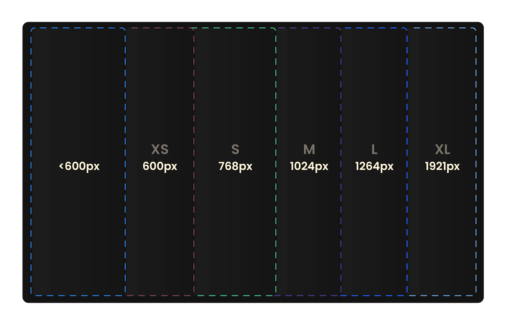
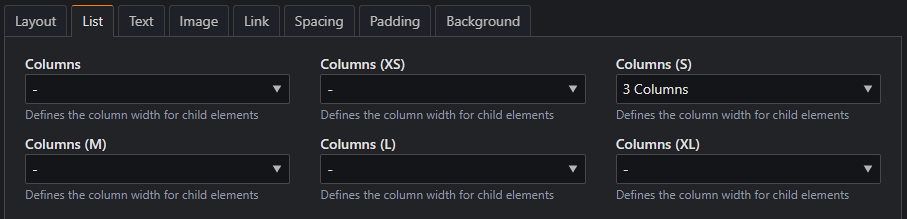
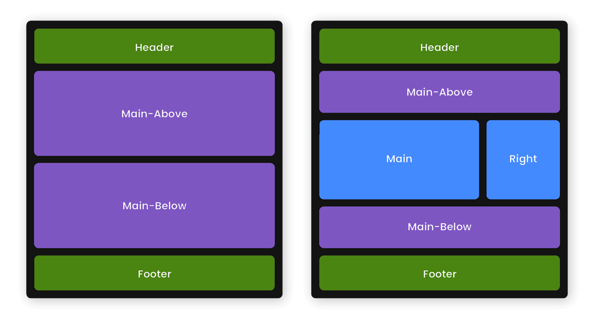
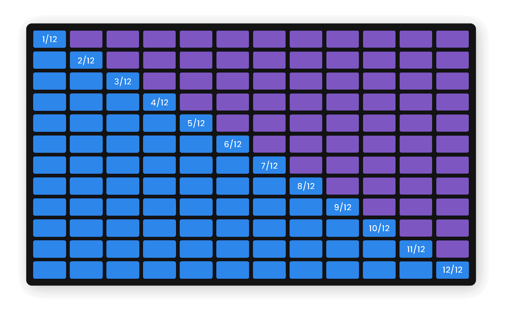

# Layout

Die nachfolgenden Kapitel beschreiben Einstellungen, welche Auswirkungen auf das visuelle Verhalten der Website haben.

___

## Breakpoints

`$breakpoints`

Breakpoints werden verwendet, um das Layout einer Website auf verschiedene Bildschirmbreiten anzupassen, was als
[Responsive Webdesign](https://de.wikipedia.org/wiki/Responsive_Webdesign) bezeichnet wird. Dadurch kann das
Erscheinungsbild je nach Gerät oder Fenstergröße optimiert werden.

Typische Breakpoints sind beispielsweise für

- Smartphones (kleine Bildschirme)
- Tablets (mittelgroße Bildschirme)
- Desktops (große Bildschirme)

definiert, um ein konsistentes und benutzerfreundliches Erlebnis auf unterschiedlichen Geräten zu gewährleisten. Im
Gegensatz zu anderen CSS-Frameworks legt der ThemeManager auch Wert auf Bildschirme, die über Full HD (1920 x 1080)
hinausgehen.
{loading=lazy}

Der ThemeManager fügt sechs Breakpoints hinzu, die sich in den StyleManager-Einstellungen als Suffix der Konfigurationen
widerspiegeln, zum Beispiel `(xs)`.

{loading=lazy}

| Breakpoint | Bildschirmgröße |                    Geräte |
|------------|----------------:|--------------------------:|
| -          |          <600px |    Smartphones (portrait) |
| xs         |          ≥600px |   Smartphones (landscape) |
| s          |          ≥768px | kleine Tablets (portrait) |
| m          |         ≥1024px |        Tablets (portrait) |
| l          |         ≥1264px |           Desktop (1080p) |
| xl         |         ≥1921px |       Desktop (1440p, 4k) |

Jeder Breakpoint kann individuell angepasst werden, der Name kann aber nicht geändert werden.

???+ example "Verfügbare (S)CSS-Variablen"

    <div class="grid" markdown>
    ```scss title="SCSS"
    $breakpoints: (
      xs: 600px,  // 37.5rem
      s:  768px,  // 48rem
      m:  1024px, // 64rem
      l:  1264px, // 79rem
      xl: 1921px  // 120rem
    )
    ```
    ```css title="CSS"
    /* Zu erwähnen ist, dass Custom properties
    nicht in Media queries funktionieren */
    var(--bp-xs)
    var(--bp-s)
    var(--bp-m)
    var(--bp-l)
    var(--bp-xl)
    ```

    </div>

### Media queries

Sofern der Skin mit [SCSS](https://sass-lang.com/guide/) geschrieben und im Theme eingebunden wird, können mit den
folgenden Mixins auf die
Breakpoints zugegriffen werden:

???+ example "Verfügbare SCSS-Mixins"

    ```scss title="Min width"
    @include media-breakpoint('xs') { ... } // @media (min-width: 600px)  { ... }
    @include media-breakpoint('s')  { ... } // @media (min-width: 768px)  { ... }
    @include media-breakpoint('m')  { ... } // @media (min-width: 1024px) { ... }
    @include media-breakpoint('l')  { ... } // @media (min-width: 1264px) { ... }
    @include media-breakpoint('xl') { ... } // @media (min-width: 1921px) { ... }
    ```
    ```scss title="Max width"
    @include max-breakpoint('xs') { ... } // @media (max-width: 599.98px)  { ... }
    @include max-breakpoint('s')  { ... } // @media (max-width: 767.98px)  { ... }
    @include max-breakpoint('m')  { ... } // @media (max-width: 1023.98px) { ... }
    @include max-breakpoint('l')  { ... } // @media (max-width: 1263.98px) { ... }
    @include max-breakpoint('xl') { ... } // @media (max-width: 1920.98px) { ... }
    ```

    !!! info
    
        Mehr zu der Subtraktion von 0.02px kann hier gefunden werden: https://www.w3.org/TR/mediaqueries-4/#mq-min-max

___

## Verhalten

Die Einstellungen dieser Kategorie beeinflussen das Verhalten des
[Inhaltslayouts](../../installation/setup.md#inhaltslayout) und ermöglichen dabei drei einstellbare Breiten
(small, medium, large) für die linke und/oder rechte Spalte.

### Verhaltensänderung

`$layout-column-[small|medium|large]-break` `$layout-column-width-*` `$layout-column-gutter-*`

Diese Optionen erlauben die Auswahl eines [Breakpoints](#breakpoints) für die Verhaltensänderung, bei welcher die linke
und/oder
rechte Spalte in der gleichen Reihe wie die Hauptspalte angezeigt werden.

{loading=lazy}

Über `$layout-column-width-*` können die Breiten für die linke und rechte Spalte eingestellt werden. Mit
`$layout-column-gutter` wird der Abstand zur Hauptspalte konfiguriert.

!!! tip

    Sofern nur eine oder zwei Breakpoints gewünscht sind, kann das kleinere `$layout-column-[]-break` auf die gleiche
    Einstellung wie die des nachfolgenden eingestellt werden.

___

## Artikel

### Horizontale Breite

`$x-spacing-large-m` `$x-spacing-large-l` `$x-spacing-small`

Die horizontale Breite kontrolliert die Breite des Inhalts von Artikeln, um sicherzustellen, dass der Inhalt auf großen
Bildschirmen nicht übermäßig gedehnt wird. Dies dient dem Lesefluss und verhindert schlechten Fokus, indem eine
angemessene Begrenzung für die Breite des sichtbaren Inhalts festgelegt wird.

In Artikeln kann die Breite dieser unter `Component > Article-Spacing > Left-Right-Spacing` eingestellt werden. Die
Einstellungen greifen hier bei folgenden Bildschirmbreiten bzw.
[Media-Queries](https://developer.mozilla.org/en-US/docs/Web/CSS/CSS_media_queries/Using_media_queries):

| Left-Right-Spacing | Media-Query                | Variable             | CSS-Klasse  |
|--------------------|----------------------------|----------------------|-------------|
| Small              | Wert in `$x-spacing-small` | `$x-spacing-small`   | `.art-px-1` |
| Medium             | Breakpoint `l`             | `$x-spacing-large-l` | `.art-px-2` |
| Large              | Breakpoint `m`             | `$x-spacing-large-m` | `.art-px-3` |

??? example "Verfügbare (S)CSS-Variablen"

    <div class="grid" markdown>
    ```scss title="SCSS"
    $x-spacing-small
    $x-spacing-large-l
    $x-spacing-large-m
    ```
    ```css title="CSS"
    /* Die Artikelbreite kann durch folgende
    custom property gesetzt werden: */
    var(--art-wdth)
    ```
    </div>

### Horizontaler Abstand zum Bildschirmrand

`$article-outer-padding`

### Vertikaler Abstand

`$article-spacing-*` `$article-main-spacing-bottom`

### Höhen

`$article-min-vheight` `$article-options-vheight`

___

## Grid

`$grid-columns` `$grid-gutter-width` `$grid-gutter-bottom`

Das CSS-Framework des Contao ThemeManagers verwendet ein
[Flexbox](https://css-tricks.com/snippets/css/a-guide-to-flexbox/)-basiertes 12-Spalten-Grid-System, in das sich die
Inhaltselemente in Artikeln einordnen lassen.

Ein Artikel dient hierbei immer als Grid-Container, der die Ausrichtung der Kind-Elemente (Inhaltselemente) steuern
kann.
Inhaltselemente lassen sich in das 12-Spalten-Raster einordnen.

{loading=lazy}
!!! danger "Spaltenanzahl von 12 ($grid-columns)"

    Es wird nicht empfohlen, die Anzahl der Spalten von 12 zu ändern, da die Optionen des StyleManagers nicht
    aktualisiert werden!

Die Breite zwischen den Spalten lässt sich über `$grid-gutter-width`, der Abstand nach unten über `$grid-gutter-bottom`
einstellen. Die Optionen finden sich als *Gutter* in den Style-Manager Optionen wieder.

!!! info

    Die hier vorgenommene Konfiguration hat auch Auswirkungen auf das `Gutter: small`, welches die Hälfte der hier
    eingestellten Werte beträgt.

**Grid-Klassen**

| Breakpoint<br>Auflösung | **~**<br><600px | **xs**<br>≥600px | **s**<br>≥768px | **m**<br>≥1024px | **l**<br>≥1264px |       **xl**<br>≥1921px |
|------------------------:|----------------:|-----------------:|----------------:|-----------------:|-----------------:|------------------------:|
|                  Klasse |        `.col-*` |      `.col-xs-*` |      `.col-s-*` |       `.col-m-*` |       `.col-l-*` |             `.col-xl-*` |
|       Anzahl<br>Spalten |                 |                  |                 |                  |                  | 12<br>*($grid-columns)* |

??? example "Verfügbare (S)CSS-Variablen"

    <div class="grid" markdown>
    ```scss title="SCSS"
    // Spalten
    $grid-columns

    // Gutter
    $grid-gutter-width
    $grid-gutter-bottom
    ```
    ```css title="CSS"
    /* Spalten */
    var(--columns)
    
    /* Gutter */
    var(--gtr)
    var(--gtr-btm)

    /* Hälfte des Gutters (Wird verwendet
       für Padding nach links/rechts) */
    var(--gtr-half)
    
    /* Small gutter */
    var(--gtr-half-sml)
    var(--gtr-half-btm)
    ```
    </div>

### Exkurs: List (Grid-List) und Alignment

**List**

Unterschiedlich der Spaltenbreite in Artikeln und Inhaltselementen, kann die in Listen-Elementen verfügbare
StyleManager-Einstellung `Element > List` genutzt werden, um die Kind-Elemente gleichmäßig in einer Reihe zu verteilen.

Ist `Columns` auf `3 Columns` eingestellt, so werden pro Reihe drei Elemente angezeigt, weitere Elemente rutschen in die
nächste Reihe.

**Horizontales und Vertikales Alignment**

**Vertikales Alignment**

### Exkurs: Columns, Order und Offset

___

## Abstände (Innen)

### Paragraphen

`$paragraph-spacing`

### Element-Spacing

`$element-spacing-*`

### Vertikales Padding

`$top-bottom-padding-small`

### Horizontales Padding

`$left-right-padding-small`

___

## Abstände (Außen)

### Vertikales Margin

`$top-bottom-margin-*`

### Horizontales Margin

`$left-right-margin-*`

___

## Bild-Text

`$image-text-behaviour-min-width` `$image-text-ratio-options`