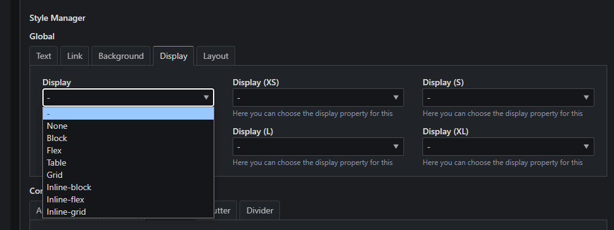

# Sonstiges

Unter *Sonstiges* fällt jede Einstellung, welche so speziell ist, dass sie keiner Kategorie zugeordnet werden konnte.

## Schatten / Schlagschatten

`$box-shadow`

<div class="grid cards" style="margin:5px;box-shadow: 0 0 5px 5px var(--md-primary-fg-color)" markdown>

- **$box-shadow**

    ---

    Über diese Einstellung kann die in den *Elementen* und *Komponenten* vorhandene Einstellung
  
    > `Box` -> `Shadow`
  
    eingestellt werden, sodass der Schlagschatten[^1] beeinflusst werden kann.

</div>

??? example "Verfügbare (S)CSS-Variablen"

    <div class="grid" markdown>
    ```scss title="SCSS"
    $box-shadow
    ```
    ```css title="CSS"
    var(--box-shadow)
    ```
    </div>

## Text-Highlight-Farbe

`$selection-color` `$selection-color-invert` `$selection-bg` `$selection-bg-invert`

Die Highlight-Farbe (`$selection-color`) und Hintergrundfarbe (`$selection-bg`) erscheinen,
wenn <span style="background: var(--md-primary-fg-color); color: #FFF">Text auf der Website markiert</span> wird.

!!! info

    Die Highlight-Farbe des CSS-Frameworks ist für die reguläre und invertierte Text-Farbe voreinstellt, sodass der 
    Hintergrund immer in der primären Farbe und der Text in der invertierten Farbe angezeigt wird.

    In der invertierten Form wird der Hintergrund in der `body`-Farbe, der Text in der regulären Farbe angezeigt.

??? example "Verfügbare (S)CSS-Variablen"

    <div class="grid" markdown>
    ```scss title="SCSS"
    $selection-color
    $selection-bg
    $selection-color-invert
    $selection-bg-invert
    ```
    ```css title="CSS"
    var(--selection-clr);
    var(--selection-bg);
    ```
    </div>

## Seitenverhältnisse für Bilder

`$aspect-ratios`

!!! abstract "Aspect ratios"

    Hierbei handelt es sich um eine dynamische Veriable, welche verschiedene Seitenverhältnisse in den 
    **Bild-Einstellungen** (`Image -> Aspect-Ratio`) bereitstellt.

    Dynamische Einstellungen stehen erst nach `Speichern & Kompilieren` zur Verfügung, da die neuen Optionen sowohl in
    den Style-Sheet-Dateien als auch in den dynamischen Style-Manager-Optionen (templates/style-manager-tm.xml)
    hinterlegt werden.

## Weitere Hintergrund-Größen

`$background-sizes`

!!! abstract "Background sizes"

    Hierbei handelt es sich um eine dynamische Veriable, welche weitere Hintergrundgrößen in den 
    **Hintergrund-Einstellungen** (`Background -> Size`) bereitstellt.

    Dynamische Einstellungen stehen erst nach `Speichern & Kompilieren` zur Verfügung, da die neuen Optionen sowohl in
    den Style-Sheet-Dateien als auch in den dynamischen Style-Manager-Optionen (templates/style-manager-tm.xml)
    hinterlegt werden.

## Dynamische Display-Eigenschaften

`$activate-display-utilities` `$display-properties`

Wenn `$activate-display-utilities` aktiviert ist, erzeugt dies die in `$display-properties`
eingetragenen [Display-Eigenschaften](https://developer.mozilla.org/en-US/docs/Web/CSS/display), welche nach dem
Kompilieren für alle Breakpoints gelten. Nach der Generierung erfolgt die Benennung der Klassen nach folgendem Schema:

* ```.d-{Eigenschaft}``` für den Standard
* ```.d-{Breakpoint}-{Wert}``` für die Breakpoints xs, s, m, l und xl.

In `$display-properties` können die gewünschten
[Display-Eigenschaften](https://developer.mozilla.org/en-US/docs/Web/CSS/display) nacheinander eingetragen werden.

{loading=lazy}

Bei
```none block flex table grid inline-block inline-flex inline-grid```
stehen nach dem Kompilieren die Eigenschaften in der StyleManager-Gruppe "Display" in jedem Artikel, Inhaltselement und
Modul zur Verfügung.

[^1]: Wie der `box-shadow` eingestellt wird, kann
den [mdn web docs](https://developer.mozilla.org/en-US/docs/Web/CSS/box-shadow) entnommen werden.
