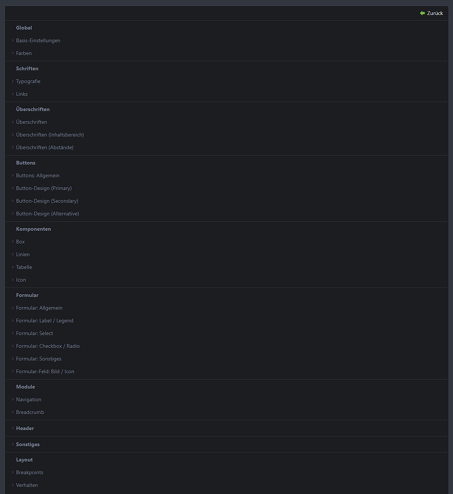

# Übersicht

## Variablen des Frameworks

Innerhalb der Theme-Konfiguration können sämtliche Variablen des CTM-Frameworks überschrieben werden, um das
Erscheinungsbild jeder Webseite nach Bedarf anzupassen.

!!! info
    Jeder Bezeichner einer einzustellenden Variable entspricht der jeweiligen
    [SCSS-Variable](https://sass-lang.com/guide/#variables), wodurch der Wert im [Skin](/pages/docs/configuration/skin)
    abgerufen werden kann.

## Konfigurationsstruktur

In Version 2.0 des Contao ThemeManagers wurde die Konfiguration angepasst, sodass die hier dokumentierte Reihenfolge der
Theme-Konfiguration mit der im Contao-Backend übereinstimmt.

-   :octicons-globe-24: __[Global](/pages/docs/configuration/theme/global/)__ 

    ---

    Die globalen Einstellungen betreffen grundlegende Aspekte wie Farben und Root-Schriftgröße.

-   :octicons-typography-24: __[Schriften](/pages/docs/configuration/theme/fonts/)__

    ---

    In diesem Abschnitt können die Typografie sowie Links angepasst werden.

-   :octicons-heading-24: __[Überschriften](/pages/docs/configuration/theme/headings/)__

    ---

    Hier erfolgt die Konfiguration von Schriftgrößen, Farben und weiteren Optionen für Überschriften (*h1* - *h6*).

-   :material-button-pointer: __[Buttons](/pages/docs/configuration/theme/buttons/)__

    ---

    Änderungen am Erscheinungsbild von Buttons und Links, für die der Button-Stil über den StyleManager festgelegt wurde.

-   :octicons-table-24: __[Komponenten](/pages/docs/configuration/theme/components/)__

    ---

    Dieser Bereich ermöglicht die Anpassung des Aussehens von Cards (Box), Linien, Tabellen und der Icon-Komponente.

-   :material-form-textbox: __[Formular](/pages/docs/configuration/theme/form/)__

    ---

    Über die Formular-Konfiguration kann das gesamte Erscheinungsbild von `form`, `select`, `input`, `textarea`, `label`,
    und `legend` festgelegt werden.

-   :material-navigation-variant-outline: __[Module](/pages/docs/configuration/theme/modules/)__

    ---

    Einstellungen für Navigationen und die Breadcrumb-Navigation.

-   :material-page-layout-header: __[Header](/pages/docs/configuration/theme/header/)__

    ---

    Dieser Abschnitt behandelt die Konfiguration des `<header>`-Elements.

-   :material-selection: __[Sonstiges](/pages/docs/configuration/theme/miscellaneous/)__

    ---

    Einstellungen für Textauswahl-Farbe, Schatten und Seitenverhältnisse von Bildern.

-   :material-view-grid-plus-outline: __[Layout](/pages/docs/configuration/theme/miscellaneous/)__

    ---

    Alle Einstellungen, die das Layout des Frameworks beeinflussen. Hierzu gehören Breakpoints, das responsive Verhalten, Artikel-Abstände, das Grid, Paddings sowie Margins.

