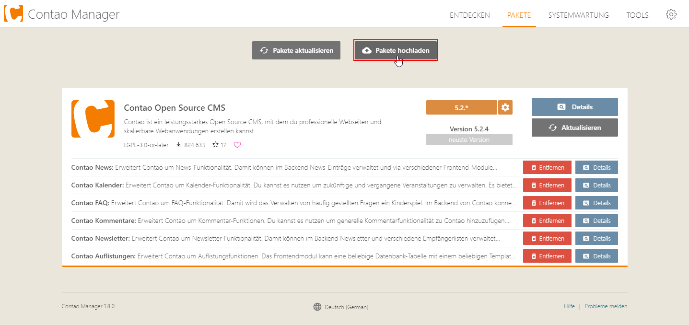

# Demo als Artefakt über den Contao Manager installieren

## 1. Contao Manager installieren
Hier findest Du [eine Anleitung, wie Erweiterungen über den Contao Manager installiert](https://docs.contao.org/manual/de/installation/erweiterungen-installieren/) werden können.

## 2. Demo herunterladen
Hier findest Du eine Liste der letzten Demo-Versionen. Klicke auf die Version, die Du installieren möchtest, sowie zu Deiner Contao-Version passt und lade das entsprechende Paket herunter.

| Contao Version |                                           Product Installer                                           |                               Contao Manager Artefakt                               |
|----------------|:-----------------------------------------------------------------------------------------------------:|:-----------------------------------------------------------------------------------:|
| `5.2`          |    [💾](https://www.contao-thememanager.com/files/demo/contao-thememanager-demo-5.2-1.0.0.content)    |  [💾](https://github.com/contao-thememanager/demo/blob/5.2/docs/demo/ctm-demo.zip)  |
| `4.13`         |   [💾](https://www.contao-thememanager.com/files/demo/contao-thememanager-demo-4.13-1.0.0.content)    |  [💾](https://github.com/contao-thememanager/demo/blob/4.13/docs/demo/ctm-demo.zip) |

## 3. Artefakt installieren

Sofern wir eine Artefakt-Datei vorliegen haben, können wir diese ganz einfach per Drag & Drop in den Contao Manager ziehen oder über den Button _Pakete hochladen_ bereitstellen.

Anschließend prüft der Contao Manager das hochgeladene Paket und fragt bei Erfolg, ob diese Paket hinzugefügt werden soll.

Bei Klick auf _Paket hinzufügen_ wird die Demo für das Projekt bereitgestellt und kann anschließend über den Button _Änderungen anwenden_ installiert werden.

