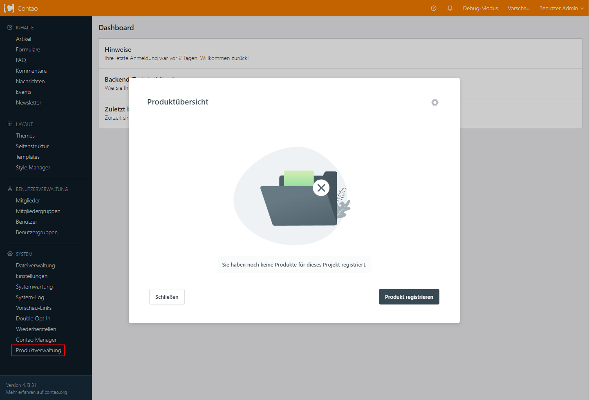
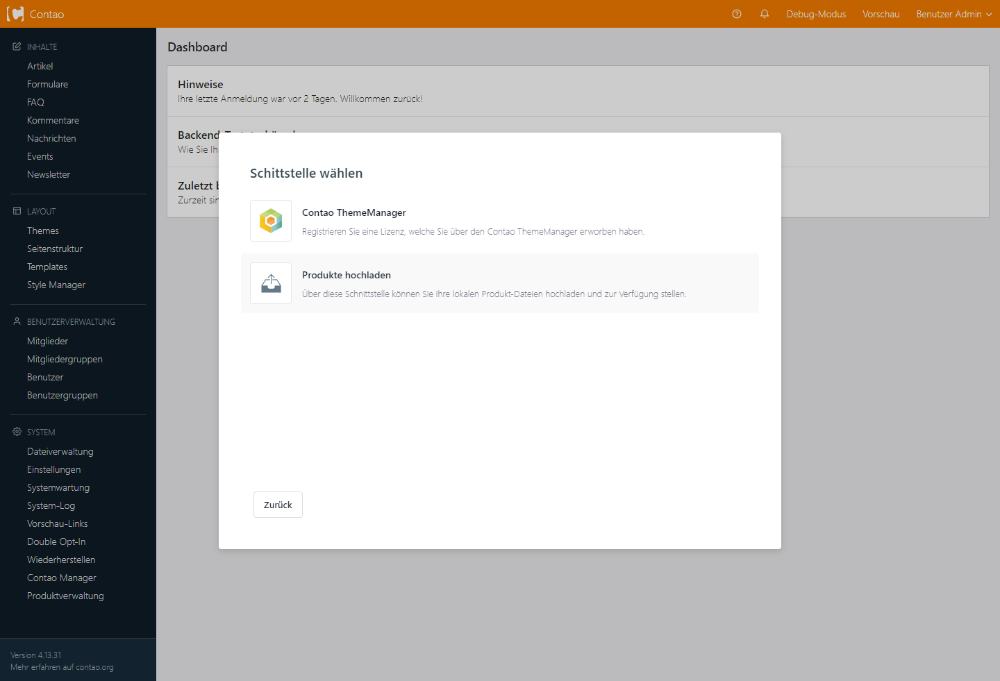
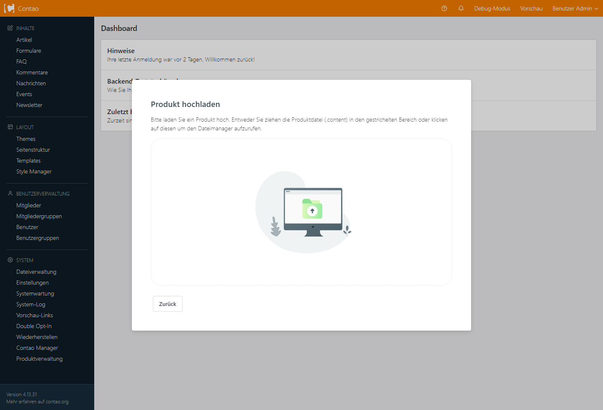
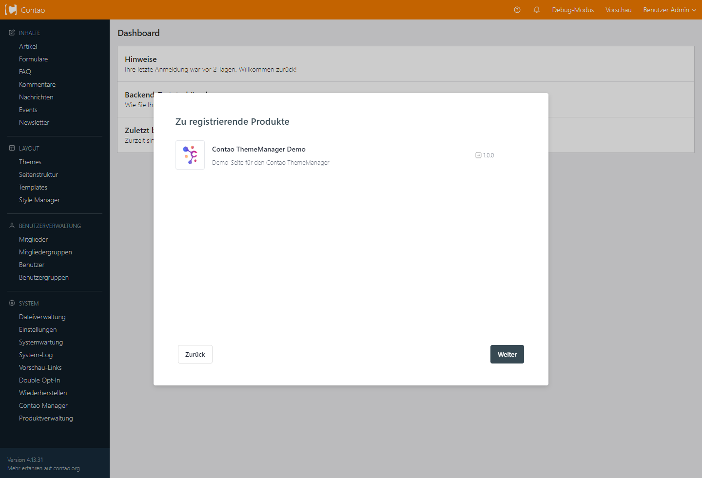
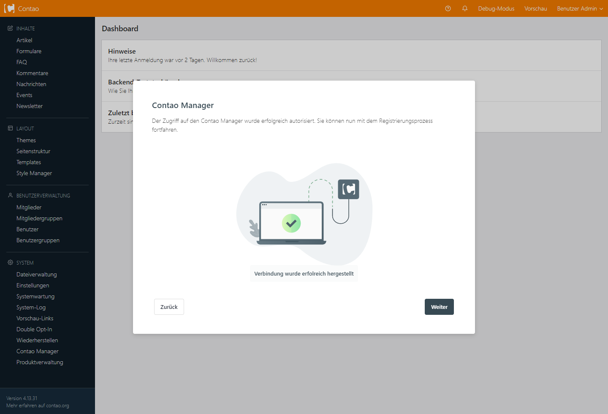
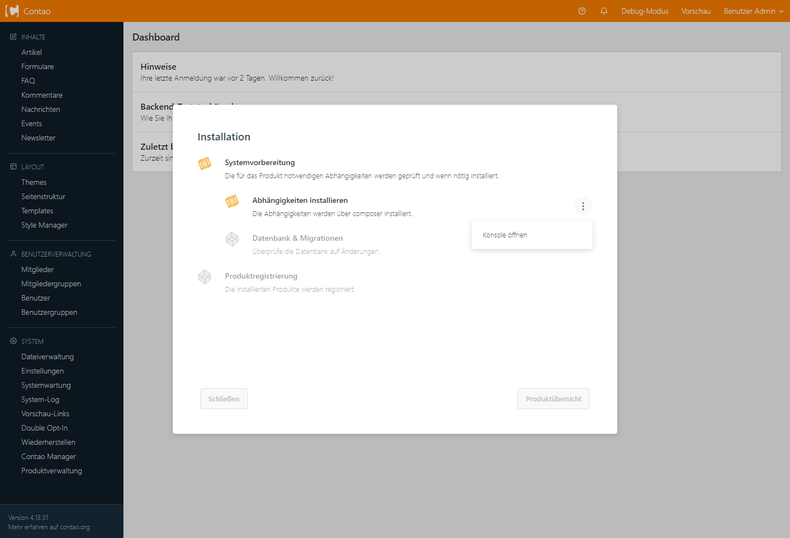
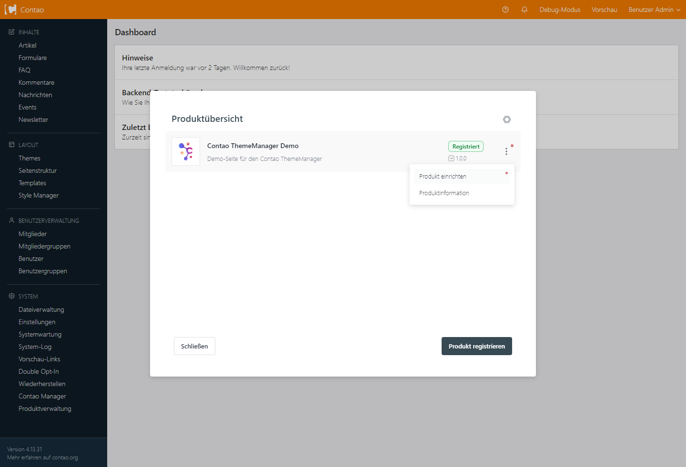
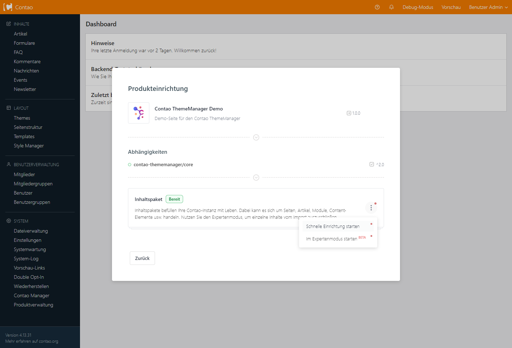

# Demo über den Product Installer installieren

## 1. Product Installer installieren

!!! info

    Für die Installation über die Kommandozeile muss [Composer](https://getcomposer.org/) auf dem System installiert sein.

=== "Composer"

    ```shell
    composer require oveleon/contao-theme-manager-bridge 1.0
    ```

=== "Contao Manager"

    Im Contao Manager steht der _Product Installer_ für den Contao ThemeManager unter dem Namen `ThemeManager: Product Installer` zur Verfügung.
    !!! tip
        Hier findest Du [eine Anleitung, wie Erweiterungen über den Contao Manager installiert](https://docs.contao.org/manual/de/installation/erweiterungen-installieren/) werden können

## 2. Demo herunterladen

Hier findest Du eine Liste der letzten Demo-Versionen. Suche die Version, welche Du installieren möchtest, sowie zu
Deiner Contao-Version passt und lade das entsprechende Paket herunter.

!!! note

    Produkte, welche sich über den _Product Installer_ installieren lassen, enden immer mit `.content`

| Contao Version |                                                 Product Installer                                                 |                                       Contao Manager Artefakt                                       |
|----------------|:-----------------------------------------------------------------------------------------------------------------:|:---------------------------------------------------------------------------------------------------:|
| `5.3`          | [:material-download:](https://www.contao-thememanager.com/files/demo/contao-thememanager-demo-5.3-1.0.0.content)  | [:material-download:](https://github.com/contao-thememanager/demo/blob/5.3/docs/demo/ctm-demo.zip)  |
| `4.13`         | [:material-download:](https://www.contao-thememanager.com/files/demo/contao-thememanager-demo-4.13-1.0.0.content) | [:material-download:](https://github.com/contao-thememanager/demo/blob/4.13/docs/demo/ctm-demo.zip) |

## 3. Demo installieren und einrichten

Sofern der _Product Installer_ installiert und die Demo heruntergeladen ist, können wir mit der Einrichtung dieser
beginnen. Nach erfolgreicher Installation erscheint ein neuer Menüpunkt "Produktverwaltung" im Contao-Backend, welcher bei Klick den _Product Installer_
öffnet.



#### Produkt registrieren

Im nächsten Schritt möchten wir die Demo registrieren, damit die Einrichtung über den _Product Installer_ zur Verfügung
gestellt wird.

Mit Klick auf **Produkt registrieren** gelangen wir in die nächste Maske, in der ein bis mehrere Schnittstellen (abhängig der installierten Abhängigkeiten) zur Verfügung
gestellt werden. Da wir die Demo als lokale content-Datei vorliegen haben, können wir diese direkt über die
Schnittstelle "Produkte hochladen" registrieren.

!!! info

    Sollten keine weiteren Schnittstellen installiert sein, kann es sein, dass Du bei Klick auf
    **Produkt registrieren**, direkt in die "Produkt hochladen" Maske geleitet wirst.



#### Produkt hochladen

Die Schnittstelle "Produkte hochladen" bietet Dir eine Uploadmöglichkeit lokaler Produktpakete. Hier kannst Du die
Produktdatei (`.content`) der Demo bequem in die gestrichelte Linie ziehen oder per Klick auf das Upload-Symbol zur
Verfügung stellen.
Anschließend wird die Produktdatei vom _Product Installer_ geprüft und angezeigt.



#### Produktprüfung

Hat alles funktioniert bekommen wir im nächsten Schritt eine Übersicht des Produktes.

!!! note

    Es könnte sein, dass Du eine Fehlermeldung bekommst, mit dem Hinweis, dass Deine Contao-Version nicht für das
    Produkt geeignet ist. Bitte überprüfe in diesem Fall Deine Contao-Version, sowie die Version der heruntergeladenen
    Demo.



#### Contao Manager Authentifizierung

In der nächsten Maske wird geprüft, ob eine Verbindung zum Contao Manager hergestellt werden kann. Diese
wird benötigt, um das Produkt ordnungsgemäß mit allen Abhängigkeiten zu installieren.
In diesem Schritt könnten drei Szenarien auftreten. Bitte folge den Hinweisen des _Product Installers_, um Dein Projekt
im Contao Manager zu authentifizieren.

|    |   Installiert    | Authentifiziert  | Beschreibung                                       |
|----|:----------------:|:----------------:|:---------------------------------------------------|
| 🟢 | :material-check: | :material-check: | Der Contao-Manager ist einsatzbereit und verbunden |
| 🟡 | :material-check: | :octicons-x-24:  | Die Authentifizierung ist ausstehend               |
| 🔴 | :octicons-x-24:  | :octicons-x-24:  | Der Contao-Manager ist nicht installiert           |

!!! warning

    Ab Version `1.7.0` des Contao Managers muss das Projekt eine SSL-Verbindung aufweisen, um die
    Authentifizierungen durchzuführen.

!!! question "Ich habe den Contao-Manager installiert, der Product-Installer erkennt es aber nicht?"

    Prüfe zunächst, ob der Contao Manager installiert ist, aufgerufen werden kann und funktioniert.

    Stelle zudem sicher, dass in der composer.json das `contao/manager-bundle` als Abhängigkeit hinterlegt und installiert ist.

    Möglicherweise wurde der Dateiname der `contao-manager.phar.php` abgeändert, ohne diese Änderung in einer
    `config/config.yaml` der Contao-Installation einzutragen:

    ```yaml
    contao_manager:
      manager_path: neuerDateiName.phar.php
    ```
    
    Lösche außerdem anschließend den Cache und versuche es erneut.

Sofern die Verbindung hergestellt wurde, siehst Du folgende Maske:



#### Produktvorbereitung und -registrierung

Nach Klick auf **Weiter** kommen wir in die eigentliche Produktregistrierung und Installation der Abhängigkeiten. Hier
erhältst du eine Übersicht der Prozesse, welche durchgeführt werden müssen, um dein Produkt zu registrieren und
anschließend einrichten zu können.
Mit einem weiteren Klick auf **Starten** wird dieser Prozess gestartet.

!!! tip

    Über die drei Punkte ( **⋮** ) neben einem Prozess können Details zu diesem aufgerufen oder Aktionen angewendet
    werden.



Sofern die Notwendigkeit besteht, eine Datenbankmigrierung durchzuführen, muss diese manuell über das Menü ( **⋮** )
gestartet werden.

!!! note

    Sollten Probleme während der Datenbankmigration auftreten, kann dieser Schritt übersprungen werden. Bitte führe die
    Migration der Datenbank anschließend über den Contao Manager oder auf der Kommandozeile durch.

#### Produkteinrichtung

Sofern alle Prozesse erfolgreich durchgelaufen sind, steht das Produkt in der
Produktübersicht des _Product Installers_ bereit und kann somit eingerichtet werden.
Über das Menü ( **⋮** ) kannst Du Informationen des Produktes einsehen, sowie die Einrichtung dessen starten.

!!! info

    Ein registriertes Produkt kann mehrfach in Deiner Contao Instanz eingerichtet werden.



In der Einrichtungsmaske eines Produktes wird zunächst geprüft, ob alle Abhängigkeiten installiert und auf
dem neusten Stand sind. Ein Produkt kann mehrere sog. Inhaltspakete beinhalten, welche sich einzeln einrichten lassen. Die Einrichtung kann über das Menü ( **⋮** ) des jeweiligen
Inhaltspaketes gestartet werden.


!!! warning

    Wir empfehlen vorerst stets die **schnelle Einrichtung** zu verwenden!



Sobald die Einrichtung abgeschlossen ist, ist die Demo installiert. Schließen Sie den _Product Installer_ und öffnen Sie
die Live-Vorschau über das Contao Backend.
