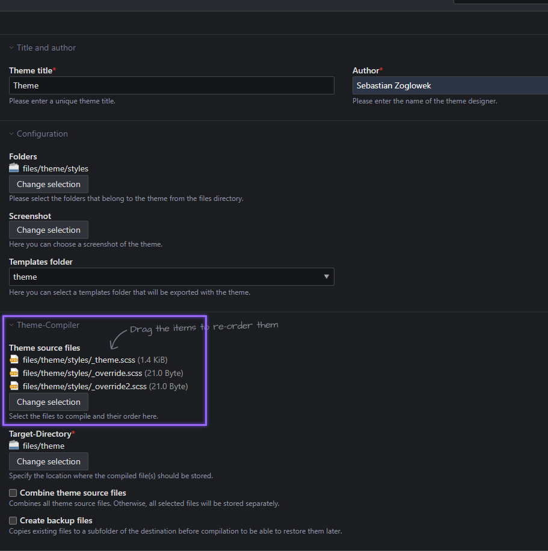

# Überschreiben und Anpassen von eingebundenen Themes und des Frameworks

Diese Anleitung beschreibt die Möglichkeit, in die Kompilierung der SCSS-Dateien einzugreifen, sodass gezielte Dateien
umgeschrieben, bzw. ausgetauscht werden können.



## Überschreiben des Contao ThemeManager Frameworks

Die in der `theme.css` enthaltenen CSS-Anweisungen kommen durch das Contao ThemeManager Framework und können über ein
Feature des Theme-Compilers gelöscht werden.

Hierbei ist es notwendig, dass bei der Einrichtung des Themes eine Datei mit Namen `_theme.scss` erstellt, und mit
nachfolgendem Inhalt eingebunden wird. Im nachfolgenden Beispiel wurden das Grid-Framework, sowie die Tabellen-Styles
deaktiviert.

!!! danger

    Die nachfolgende Änderung sollte lediglich von erfahrenen Entwicklern durchgeführt werden, da hierbei wichtige
    Bestandteile des ThemeManagers ausgehebelt werden können. Im Beispiel wird das Grid-Framework entfernt, wodurch alle
    Grid-Anweisungen des StyleManager nicht mehr funktionieren.

```scss title="ThemeManager Framework Import-Datei"
// Mixins
@import "ctm_utils";

// Base
@import "ctm_base/vars";
@import "ctm_base/defaults";
@import "ctm_base/typography";
@import "ctm_base/background";

// Layout
@import "ctm_layout/header";
@import "ctm_layout/layout";
@import "ctm_layout/list";
//@import "ctm_layout/_grid/grid-framework";
//@import "ctm_layout/_grid/grid-list";
//@import "ctm_layout/_grid/grid-gutter";
//@import "ctm_layout/_grid/grid-properties";
@import "ctm_layout/components";
@import "ctm_layout/alignmentSpacings";
@import "ctm_layout/headline-spacing";
@import "ctm_layout/article-spacing";
@import "ctm_layout/article";
@import "ctm_layout/responsive";
@import "ctm_layout/display";

// Components
@import "ctm_components/box";
@import "ctm_components/item";
@import "ctm_components/list";
@import "ctm_components/media";
@import "ctm_components/navigation";
@import "ctm_components/button";
@import "ctm_components/icon";
@import "ctm_components/icon-text";
@import "ctm_components/image-text";
//@import "ctm_components/table";
@import "ctm_components/text";
@import "ctm_components/download";
@import "ctm_components/form";
@import "ctm_components/pagination";

// Modules
@import "ctm_modules/breadcrumb";
@import "ctm_modules/search";

// Styles
@import "ctm_styles/divider";
@import "ctm_styles/background";
@import "ctm_styles/form-image";
@import "ctm_styles/form-input-icon";
@import "ctm_styles/example";

// Behaviour
@import "ctm_overrides/text-color";
@import "ctm_overrides/overflow";
```
