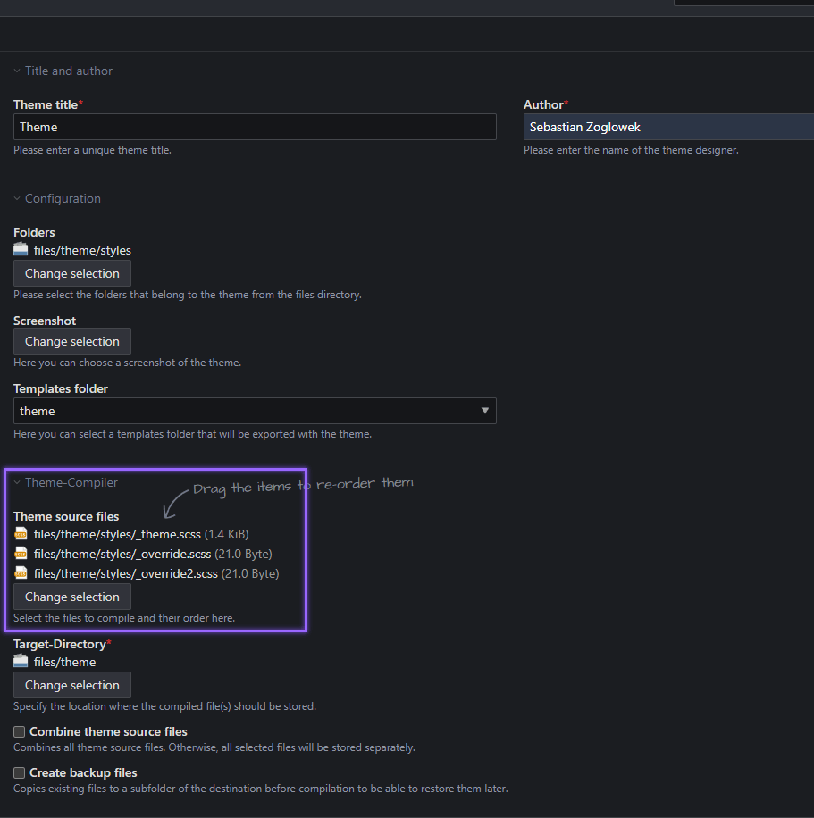
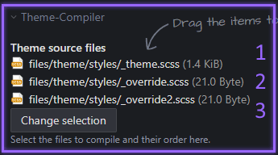
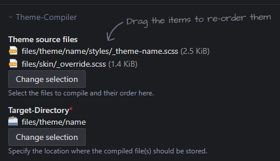
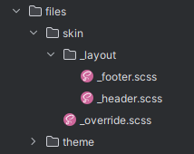

# Konfiguration des eigenen Skins und Überschreiben von vorhandenen Bestandteilen

Diese Anleitung beschreibt die Möglichkeit, deinen eigenen Skin mithilfe des Contao ThemeManager zu nutzen, damit die
eingestellten Variablen in deinen SCSS-Dateien verwendet werden können.
Über den Theme-Compiler kannst du zusätzlich in die Kompilierung eingreifen, sodass gezielt Dateien überschrieben bzw.
ausgetauscht werden können.

Jede SCSS-Datei, welche über Theme-Quelldateien eingebunden wird, kann auf alle Variablen der
[Theme-Konfiguration](../../configuration/theme/overview.md) zugreifen.

## Dein eigener Skin / Einbinden eigener SCSS-Dateien

Nachdem du die [Einrichtung](../../installation/setup.md) durchgeführt hast, kannst du in einem Theme deine
_Theme-Quelldateien_ einbinden. Für jede Quelldatei wird eine `*.css`-Datei mit selbem Namen abgelegt.

!!! info "Dateien im Layout einbinden"

    Nach dem ersten Kompilieren musst du deine css-Dateien im Layout einbinden.



### Theme-Quelldateien zusammenfassen

Hat man mehrere Dateien ausgewählt, werden diese durch Aktivieren dieser Funktion in eine `*.css`-Datei zusammengefasst.
Stelle sicher, dass du beim Hinzufügen von neuen Quell-Dateien auch die neue Datei im Layout einbindest, da sich der
Dateiname ändern könnte.

### Backup-Dateien anlegen

Mithilfe dieser Option werden bei jedem Kompilieren die vorherigen Kompilate in einem Unterordner `backup` abgelegt.

!!! warning "Backup-Dateien anlegen"

    Diese Option sollte nicht während der Entwicklung aktiviert werden, da Backup-Dateien nicht gelöscht werden.

## Überschreiben von Skin-Dateien / Themes

SCSS erlaubt das Überschreiben von importierten SCSS-Dateien, sofern nachfolgende `@import`-Anweisungen in deinen
SCSS-Dateien eingebunden werden. Über [SCSSPHP](https://github.com/scssphp/scssphp) werden jedoch nur die zuerst
importierten Dateien eingelesen, sodass Importe mit selbem Dateipfad über `@import` nicht mehr berücksichtigt werden.

Der [Theme-Compiler](https://github.com/oveleon/contao-theme-compiler-bundle) wurde erweitert, sodass die Reihenfolge
der Theme-Quelldateien nun berücksichtigt wird. Hierdurch kannst du vorher eingebundenes SCSS überschreiben.



Wenn die eingebundenen Theme-Quelldateien die SCSS-Dateien über absolute `@import`-Pfade importieren, reicht die
Einbindung einer SCSS-Datei mit nachfolgendem Inhalt. Dateien, welche du überschreiben möchtest, müssen lediglich dem
Import-Pfad folgen.
```scss
// Framework utils
@import "ctm_utils";
```

Wie du SCSS mit [Index-Files](https://sass-lang.com/documentation/at-rules/import/#index-files) überschreibst, kannst du
im Kapitel [Überschreiben des Frameworks](#uberschreiben-des-css-frameworks) nachlesen.

### Überschreiben von Theme-Dateien

Im nachfolgenden Beispiel wollen wir Teile der an erster Position eingebundenen Theme-Quelldatei mit Namen
`_theme-[name].scss`_updatesicher_ überschreiben.

!!! info

    Die CSS-Dateien des Theme-Imports sind immer _relativ_ der hier eingebundenen SCSS-Datei.

```scss title="Originales Theme (_theme-[name].scss)"
// Framework utils
@import "ctm_utils";

...

@import "_layout/footer";
@import "_layout/header";

...
```

Wir möchten in der nachfolgenden Anleitung

- das CSS des Footers überschreiben
- und das CSS des Headers löschen

**Anleitung**

   1. Erstelle zunächst eine weitere Theme-Quelldatei `_override.scss` mit einem gewünschten Namen und binde diese *nach*
      `_theme-[name].scss` ein.

      

   2. Importiere folgenden Inhalt in deine Theme-Quelldatei, damit du auf die im ThemeManager verfügbaren Funktionen
      und Mixins zugreifen kannst.

      ```scss title="_override.scss"
      // Framework utils
      @import "ctm_utils";
      ```

   3. Erstelle im selben Ordner, in diesem Beispiel `files/skin/`, einen Ordner mit Namen `_layout` und den Dateien
      `_footer.scss` und `_header.scss` und berücksichtige dabei die Ordnerstruktur im Theme-Ordner

      

   4. Kopiere den Inhalt der `_footer.scss` des Themes in deinen angelegten Ordner und passe das CSS nach deinem Belieben
      an.

      ```scss title="_layout/_footer.scss"
      // Overriding _footer.scss from a theme
      footer {
        > .inside {
          position: relative;
          margin: 0 auto;
          padding: rem(20) 0;
          max-width: sub(map-get($breakpoints, 'l'), $grid-gutter-width, 'px');
        }
      }
      ```

   5. Möchtest du das CSS der `_header.scss`-Datei des Themes löschen, lasse deine SCSS-Datei leer.

      ```scss title="_layout/_header.scss"
      // Deleting _header.scss from a theme
      // Empty
      ```

   6. Kompiliere dein Theme

!!! tip

    Diese Anleitung bezieht sich nicht nur auf das Überschreiben von Themes, sondern auch auf das Überschreiben von
    ThemeManager-Plugins, eingebundenen Erweiterungen und ähnlichem. Es dient dazu, dass Dateien *updatesicher*
    überschrieben werden können. Zusätzlich wird **kein zusätzliches CSS generiert** und an die gezielte Stelle
    kompiliert.


## Überschreiben des CSS-Frameworks

!!! danger

    Die nachfolgende Änderung sollte lediglich von erfahrenen Entwicklern durchgeführt werden, da hierbei wichtige
    Bestandteile des ThemeManagers ausgehebelt werden können. Im Beispiel wird das Grid-Framework entfernt, wodurch alle
    Grid-Anweisungen des StyleManager nicht mehr funktionieren.

Die in der `theme.css` enthaltenen CSS-Anweisungen des ThemeManager CSS-Frameworks werden über
[Index-Files](https://sass-lang.com/documentation/at-rules/import/#index-files) eingebunden, sodass du eine eigene
Import-Datei mit absoluten Pfaden nachbilden musst.

Du erstellst eine Datei mit Namen `_theme.scss` und bindest diese an erster Stelle der Theme-Quelldateien ein.
Über den nachfolgenden Inhalt kannst du somit Bestandteile des Frameworks überschreiben oder entfernen.
In diesem Beispiel wurden das Grid-Framework, sowie die Tabellen-Styles deaktiviert.

```scss title="ThemeManager Framework Import-Datei"
// Mixins
@import "ctm_utils";

// Base
@import "ctm_base/vars";
@import "ctm_base/defaults";
@import "ctm_base/typography";
@import "ctm_base/background";

// Layout
@import "ctm_layout/header";
@import "ctm_layout/layout";
@import "ctm_layout/list";
//@import "ctm_layout/_grid/grid-framework";
//@import "ctm_layout/_grid/grid-list";
//@import "ctm_layout/_grid/grid-gutter";
//@import "ctm_layout/_grid/grid-properties";
@import "ctm_layout/components";
@import "ctm_layout/alignmentSpacings";
@import "ctm_layout/headline-spacing";
@import "ctm_layout/article-spacing";
@import "ctm_layout/article";
@import "ctm_layout/responsive";
@import "ctm_layout/display";

// Components
@import "ctm_components/box";
@import "ctm_components/item";
@import "ctm_components/list";
@import "ctm_components/media";
@import "ctm_components/navigation";
@import "ctm_components/button";
@import "ctm_components/icon";
@import "ctm_components/icon-text";
@import "ctm_components/image-text";
//@import "ctm_components/table";
@import "ctm_components/text";
@import "ctm_components/download";
@import "ctm_components/form";
@import "ctm_components/pagination";

// Modules
@import "ctm_modules/breadcrumb";
@import "ctm_modules/search";

// Styles
@import "ctm_styles/divider";
@import "ctm_styles/background";
@import "ctm_styles/form-image";
@import "ctm_styles/form-input-icon";
@import "ctm_styles/example";

// Behaviour
@import "ctm_overrides/text-color";
@import "ctm_overrides/overflow";
```
