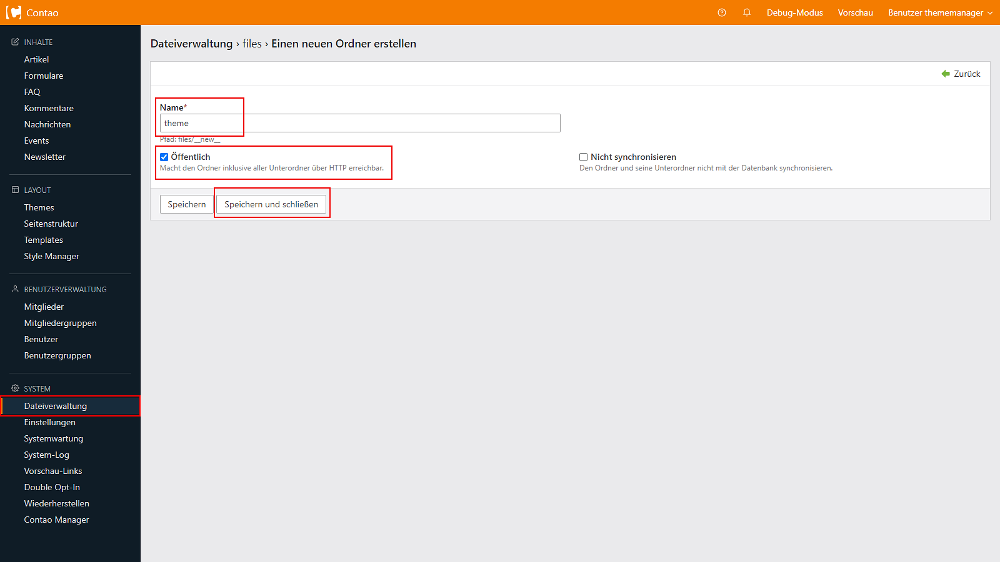
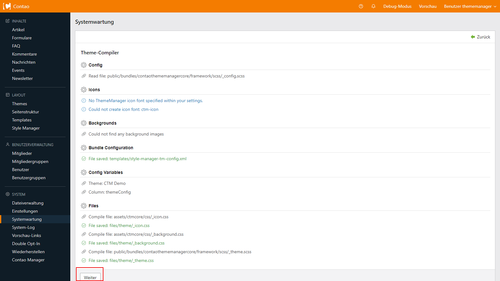
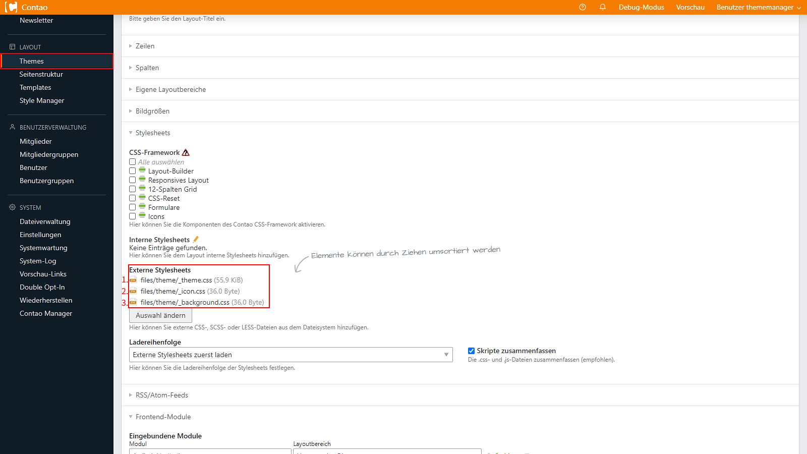
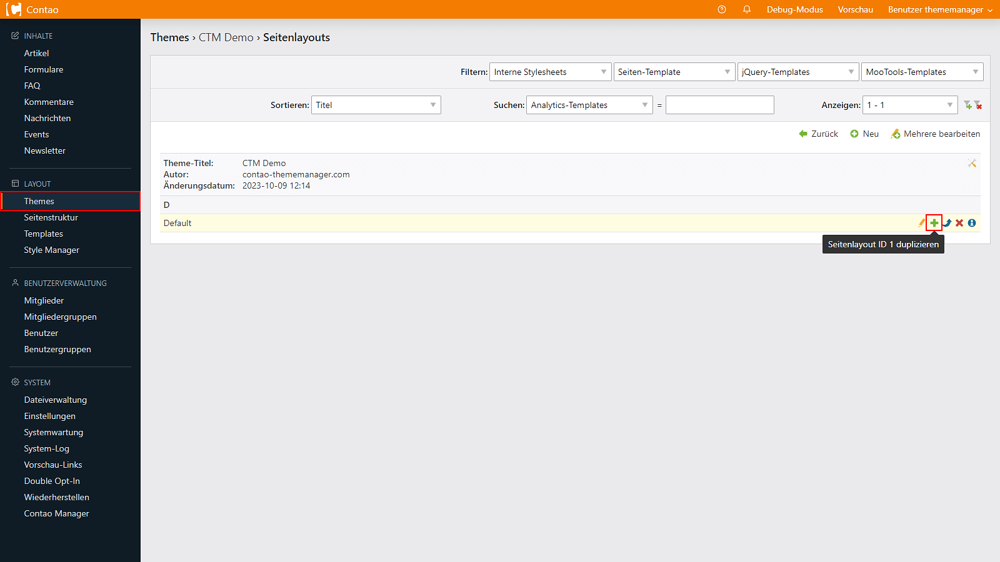
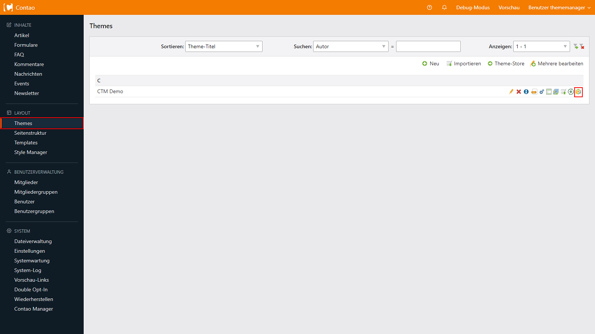
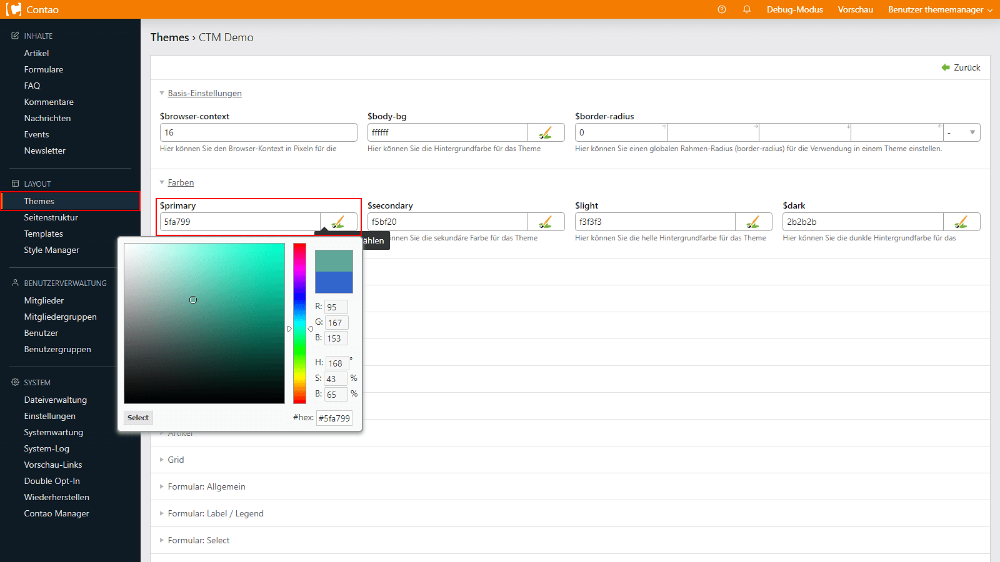
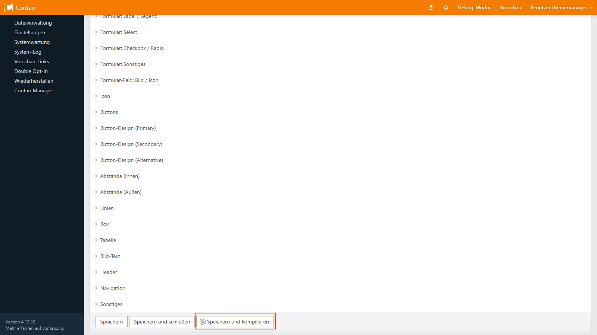

# Ersteinrichtung

Der Contao ThemeManager bedient sich einer Vielzahl von Werkzeugen, sodass vor der eigentlichen Nutzung des Frameworks
einige Schritte notwendig sind. Im Folgenden wird die Ersteinrichtung des Contao ThemeManagers Schritt für Schritt
erklärt.

## Ordner erstellen

Beginne damit, in die Dateiverwaltung *(System/Dateiverwaltung)* von Contao zu navigieren und erstelle einen Ordner, in
dem die Theme-Dateien deines erstellten Themes kompiliert werden sollen.

Stelle sicher, dass dieser Ordner öffentlich erreichbar ist.

## Theme erstellen / einstellen

Im nächsten Schritt legst du ein neues Theme *(Layout/Themes)* an. Du wirst feststellen, dass die Theme-Bearbeitung um
eine neue Palette **Theme-Compiler** erweitert wurde.

!!! info

    Schau dir die offizielle [Contao-Dokumentation](https://docs.contao.org/manual/de/layout/theme-manager/themes-verwalten/) an, um zu erfahren, wie ein Theme in Contao eingerichtet wird.

Wähle den zuvor erstellten Ordner aus, in welchen die CSS-Dateien kompiliert werden sollen. Nach der Auswahl des
Ordners kannst du durch **Speichern und kompilieren** die initialen Stylesheets
generieren.

### Compiler-Report

Nach erfolgreichem Abschluss wirst du zum Compiler-Report weitergeleitet. Hier werden drei Dateien erstellt:

| Datei           | Funktion                                                                                                                                       |
|-----------------|------------------------------------------------------------------------------------------------------------------------------------------------|
| _icon.css       | Beinhaltet das generierte Stylesheet der [Icons](../configuration/icon-set.md), die über die Systemeinstellungen eingebunden wurden.           |
| _background.css | Beinhaltet das generierte Stylesheet der [Hintergrundbilder](../configuration/backgrounds.md), die über die Dateiverwaltung festgelegt wurden. |
| _theme.css      | Enthält das [anpassbare Framework](../configuration/theme/overview.md) des Contao ThemeManagers.                                               |

## Layout(s) erstellen

In diesem Abschnitt geht es um die Anpassung der Layouts, die für eine optimale Nutzung des ThemeManagers erforderlich
sind. Das Contao ThemeManager Framework benötigt zwei neue Layoutbereiche, die standardmäßig bei der Layouterstellung
eingestellt werden:

| Eigener Layoutbereich | ID         | Position                | Funktion                                                                                  |
|-----------------------|------------|-------------------------|-------------------------------------------------------------------------------------------|
| Hauptspalte Oben      | main-above | Unterhalb der Kopfzeile | Dient der Einbindung von bspw. Hero-Artikeln oberhalb des Inhalts-Bereiches.              |
| Hauptspalte Unten     | main-below | Oberhalb der Fußzeile   | Dient der Einbindung von Artikeln, welche über die gesamte Bildschirmbreite gehen sollen. |                                               

!!! info

    Weitere Informationen zu Layouts findest du in der
    offiziellen [Contao-Dokumentation](https://docs.contao.org/manual/de/layout/theme-manager/seitenlayouts-verwalten/).

Mithilfe des ThemeManager Frameworks benötigen wir nicht mehr für jeden Zweck ein eigenes Layout. Wir empfehlen die
Erstellung der folgenden zwei Layouts.

| Layout                                                                               | Beschreibung                                                      |
|--------------------------------------------------------------------------------------|-------------------------------------------------------------------|
| [Volle Breite](#layout-fur-volle-breite)                                             | Artikel mit voller Breite                                         |
| [Mehrspaltiges Layout](#mehrspaltiges-layout-hauptspalte-linke-spalte-rechte-spalte) | Beinhaltet zusätzlich Artikel mit linker/rechter und Hauptspalte. |

### Layout für volle Breite

Dieses Layout dient der Einbindung von Artikeln mit voller Breite und ignoriert die in Contao integrierten
Layoutbereiche (Hauptspalte, Linke Spalte, Rechte Spalte).

Im nachfolgenden Beispiel nennen wir es **Default**.

Bei der Erstellung eines neuen Layouts werden bereits folgende Einstellungen durch den ThemeManager vorgenommen:

- Zeilen *(Kopfzeile, Hauptzeile und Fußzeile)*
- Spalten *(Nur die Hauptspalte)*
- Eigene Layoutbereiche *(Hauptspalte Oben, Hauptspalte Unten)*
- Frontend-Module *(Einbindung der eigenen Layoutbereiche)*
- JavaScript *(JavaScript-Template: js_ctm_core -> Polyfills)*
- Experteneinstellungen *(Viewport-Tag)*

Du musst lediglich die im vorherigen Schritt generierten Stylesheets einbinden.

Binde nun unter **Externe Stylesheets** deine durch den [Compiler](#compiler-report) erstellten Stylesheets in folgender
Reihenfolge ein:

1. _theme.css[^1]
2. _icon.css
3. _background.css[^2]

### Mehrspaltiges Layout (Hauptspalte / Linke Spalte / Rechte Spalte)

Dieses Layout bedient sich zusätzlich der in Contao integrierten Layoutbereiche:

- Hauptspalte
- Linke Spalte
- Rechte Spalte

!!! info

    Die in der [Theme-Konfiguration](../configuration/theme/global.md) zu findende Palette **Überschriften (Hauptspalte / Linke Spalte / Rechte Spalte)** dient lediglich diesem Layout und kann über "Überschriften-Einstellungen erweitern" aktiviert werden.

Um sicherzustellen, dass Artikel sowohl ober- als auch unterhalb des Hauptspaltenbereichs angezeigt werden können,
kannst du die folgenden Schritte befolgen.

Im nachfolgenden Beispiel nennen wir dieses Layout **Content**.

Dupliziere das zuvor erstellte [Layout](#layout-fur-volle-breite) und passe die gewünschte Anzahl der Spalten an.

In diesem Beispiel haben wir die Layoutbereiche **Hauptspalte** und **Reche Spalte** hinzugefügt, sodass diese jetzt
**zwischen** den Layoutbereichen **Hauptspalte Oben** und **Hauptspalte Unten** eingebunden werden können.

!!! info "Horizontaler und vertikaler Abstand"

    Der horizontale und vertikale Abstand dieser Layoutbereiche lassen sich über das Article-Spacing im Layout 
    einstellen.

## Theme-Konfiguration

Das CSS-Framework des Contao ThemeManagers kann an die eigenen Bedürfnisse angepasst werden.
Dies umfasst beispielsweise Farben, Typografie, Überschriften, Formulare, Buttons, Tabellen, Layout-Einstellungen, das
Grid, die Breakpoint-Einstellungen und vieles mehr.

Die Theme-Konfiguration lässt sich nun über die Theme-Übersicht mithilfe des
 **Theme konfigurieren**-Buttons aufrufen.

*Änderung der primären Farbe*

*Speichern und Kompilieren des Themes.*

___

Im nächsten Abschnitt [Theme konfigurieren](../configuration/theme/overview.md) erfährst du im Detail, welche Optionen
in der
Theme-Konfiguration verfügbar sind und wie sie das Aussehen und Verhalten deines Themes beeinflussen.

[^1]:
Diese Reihenfolge dient lediglich der Best-Practice des Ladens von Stylesheet-Dateien beim Erstaufruf einer Website. Da
sich innerhalb der ***_theme.css*** das Layout, Grid, Theme-Variablen und Default-Styles befinden, sollte diese Datei an
erster Stelle eingebunden werden. In bestimmten Ausnahmen wie z.B.
[FOUC](https://de.wikipedia.org/wiki/Flash_of_Unstyled_Content) oder
[Above-The-Fold-CSS](https://web.dev/articles/extract-critical-css?hl=de), können kritische CSS-Dateien vor der
***_theme.css*** eingebunden werden.

[^2]:
Es empfiehlt sich die _background.css in der Reihenfolge immer als letzte Stylesheet-Datei einzubinden, damit das
Überschreiben dieser über einen eigenen [Skin](../guides/skin/introduction.md) einfacher ist.
